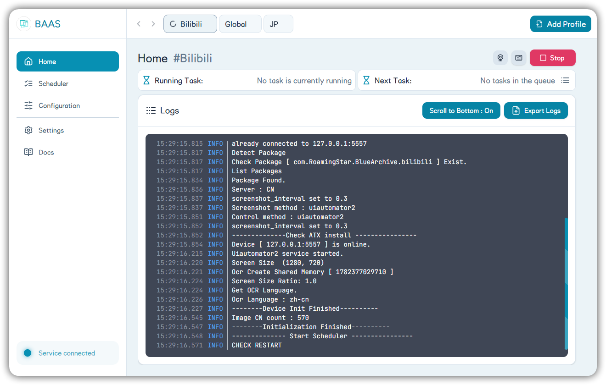
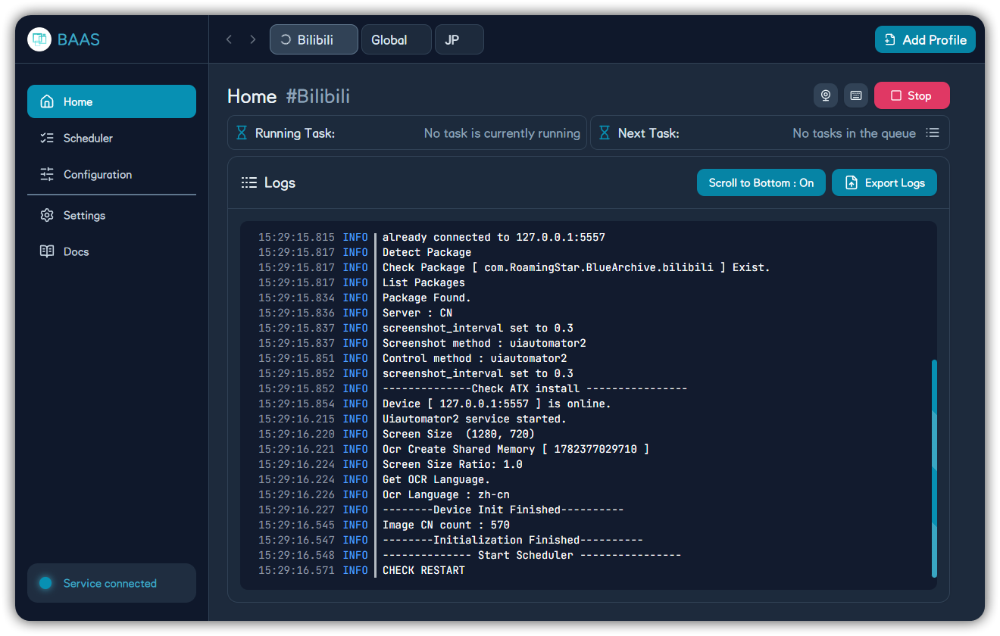
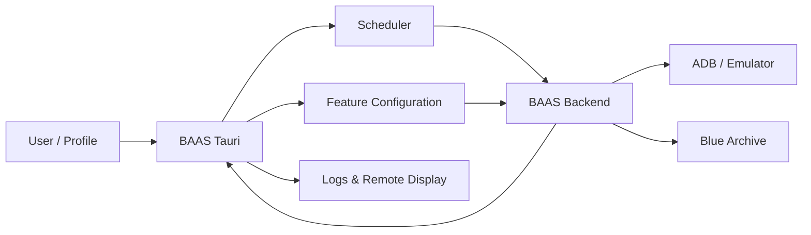
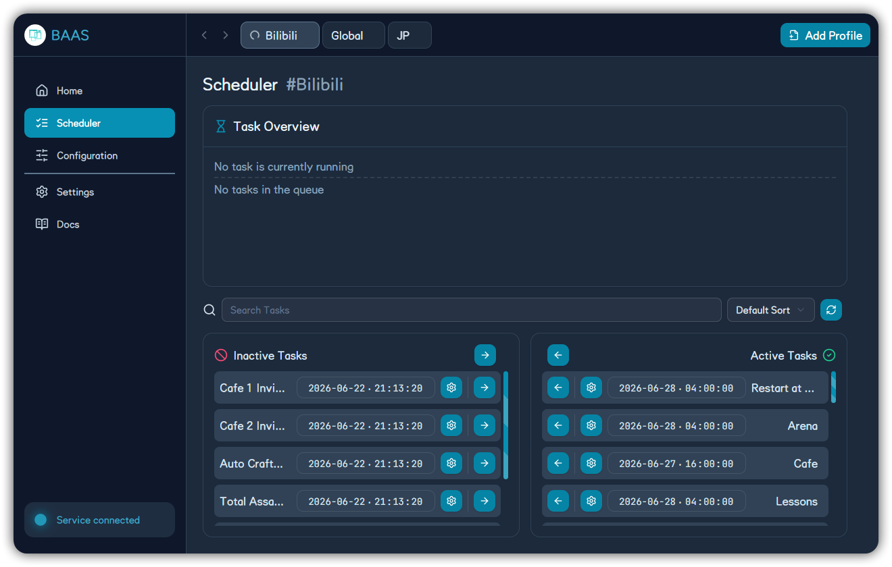
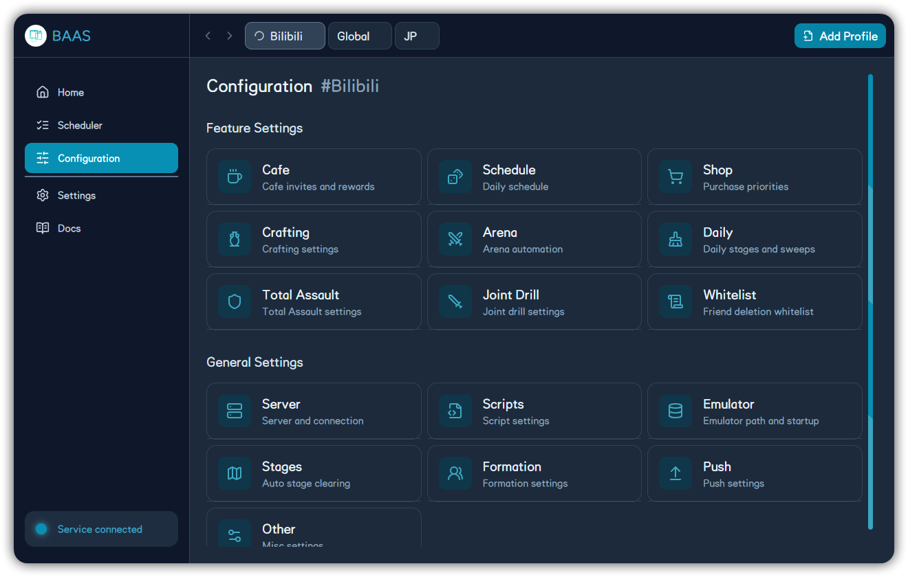
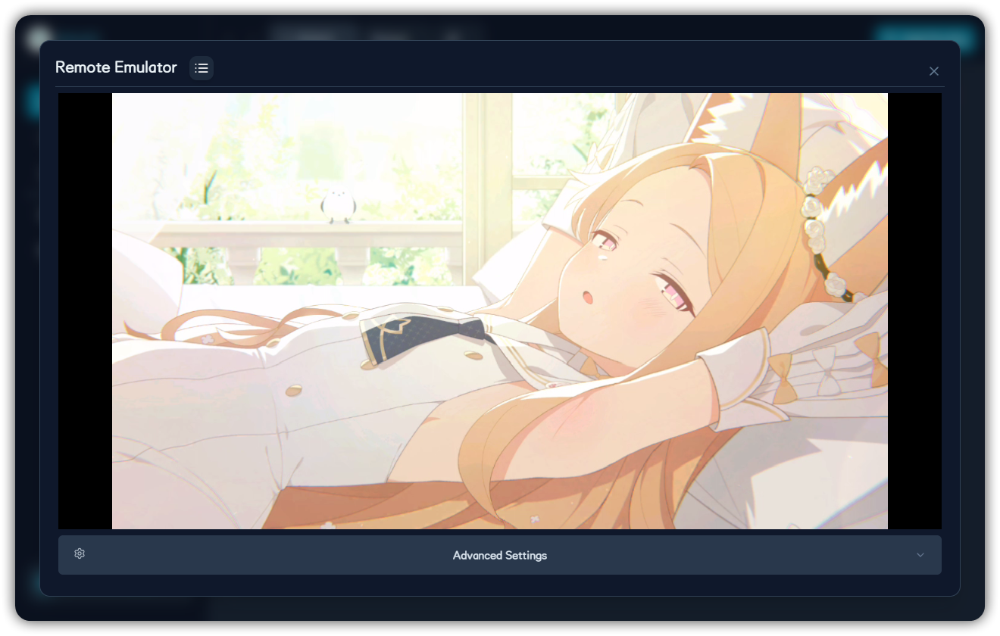
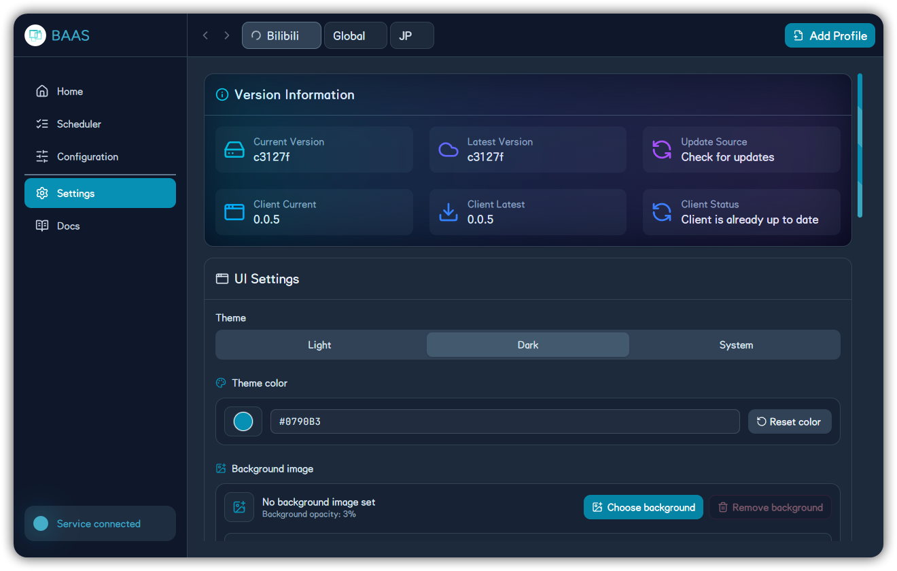

<div align="center">

  

  <h1>BAAS Tauri App</h1>

  <p><strong>Desktop command center for multi-profile Blue Archive automation</strong></p>

  <p>
    
    
    
    
    
  </p>

  <p>
    <a href="README_zh.md"><kbd>Chinese README</kbd></a>
    <a href="https://github.com/Kiramei/baas-tauri/releases/latest"><kbd>Download</kbd></a>
    <a href="https://kiramei.cn/baas-tauri"><kbd>Documentation</kbd></a>
    <a href="LICENSE"><kbd>License</kbd></a>
  </p>

</div>

| Light Mode                                                                                | Dark Mode                                                                               |
| ----------------------------------------------------------------------------------------- | --------------------------------------------------------------------------------------- |
|  |  |

---

## 🚀 Overview

BAAS Tauri is the desktop control client for [Blue Archive Auto Script](https://github.com/pur1fying/blue_archive_auto_script). It turns the BAAS backend into a daily-use desktop workbench: profile management, scheduling, feature configuration, runtime logs, remote emulator display, updater controls, and web documentation all live in one app.

The boundary is intentional:

- **Tauri orchestrates** profiles, task settings, UI state, logs, update choices, and documentation.
- **The backend executes** ADB connection, screenshots, recognition, emulator control, task execution, and state synchronization.

```text
✨ Multi-profile orchestration for different accounts, servers, and emulator instances
⚡ Real-time task queue, status cards, assets, and log streaming
🧩 Independent configuration panels for every automation domain
📺 Remote emulator display with decoder and stream tuning controls
🌐 Multilingual application UI with maintained Chinese and English documentation
📚 Fumadocs documentation site, available in-app and as a detached Tauri window
```

## 🧭 Runtime Flow



## 🧩 What It Controls

| Area             | What You Can Do                                                                                                                                    |
| ---------------- | -------------------------------------------------------------------------------------------------------------------------------------------------- |
| 🗂️ Profiles      | Separate accounts, servers, emulator instances, and task strategies.                                                                               |
| ▶️ Home          | Start or stop scheduling, inspect the running task, next task, queue, logs, assets, and remote display.                                            |
| 🗓️ Scheduler     | Enable tasks, edit next run time, search, sort, set intervals, daily reset windows, pre-tasks, and post-tasks.                                     |
| 🧩 Configuration | Configure server, emulator, script, stages, sweeps, teams, cafe, lessons, shop, crafting, combat, maintenance, push, and more.                     |
| 🎛️ Settings      | Tune theme, language, background, UI scale, remote decoder, safe stream, low performance mode, update channel, source, MirrorC CDK, and SHA tests. |
| 📚 Docs          | Load the Fumadocs documentation site inside the app Wiki page or detach it into a normal Tauri window.                                             |

## 🖼️ Screenshots

| Scheduler                                                                                                          | Feature Configuration                                                                        |
| ------------------------------------------------------------------------------------------------------------------ | -------------------------------------------------------------------------------------------- |
|  |  |

| Remote Emulator                                                                             | Settings and Updates                                                                           |
| ------------------------------------------------------------------------------------------- | ---------------------------------------------------------------------------------------------- |
|  |  |

## 📥 Download

Installers are published on [GitHub Releases](https://github.com/Kiramei/baas-tauri/releases). Use the latest Release and choose the package that matches your operating system and CPU architecture.

| System                       | Package                                       |
| ---------------------------- | --------------------------------------------- |
| Windows x64                  | `BAAS.Tauri_*_x64-setup.exe`                  |
| Windows ARM64                | `BAAS.Tauri_*_arm64-setup.exe`                |
| Windows x64 fixed WebView2   | `BAAS.Tauri_*_x64_fixed_webview2-setup.exe`   |
| Windows ARM64 fixed WebView2 | `BAAS.Tauri_*_arm64_fixed_webview2-setup.exe` |
| macOS Apple Silicon          | `BAAS.Tauri_*_aarch64.dmg`                    |
| macOS Intel                  | `BAAS.Tauri_*_x64.dmg`                        |
| Linux Debian/Ubuntu          | `BAAS.Tauri_*_amd64.deb` or `*_arm64.deb`     |
| Linux Fedora/RHEL            | `BAAS.Tauri_*_x86_64.rpm` or `*_aarch64.rpm`  |

The documentation site also includes a dynamic download panel that reads the latest GitHub Release and lists direct installer links.

## 📦 Tech Stack

| Category      | Tools                                         | Notes                                                                                |
| ------------- | --------------------------------------------- | ------------------------------------------------------------------------------------ |
| Desktop Shell | Tauri 2, Rust                                 | Native windowing, commands, capabilities, and packaging.                             |
| Frontend      | React 19.2, Vite 8, TypeScript                | Fast UI iteration and typed client code.                                             |
| Styling       | Tailwind CSS 4, CSS variables                 | Dark/light themes, accent color, background image, zoom, and responsive layout.      |
| State & Data  | Zustand, React Context, localStorage          | Profile state, config snapshots, UI preferences, and runtime state.                  |
| Realtime      | SecureWebSocket                               | Authenticated channels for provider, sync, trigger, heartbeat, and remote display.   |
| UX            | Framer Motion, Radix UI, Sonner, lucide-react | Motion, accessible primitives, toast notifications, and icon controls.               |
| Documentation | Fumadocs, Next.js, MDX, Mermaid, Blueaka      | Web docs, diagrams, bilingual content, GitHub Pages deployment, and font subsetting. |

## 📚 Documentation Site

The documentation site lives in `docs/` and is built as a separate Fumadocs/Next.js app.

```bash
cd docs
bun install
bun run dev
bun run build
```

| Language | Local URL                        |
| -------- | -------------------------------- |
| Chinese  | `http://localhost:3000/docs/zh/` |
| English  | `http://localhost:3000/docs/en/` |

Documentation policy:

- Only Chinese and English documentation are maintained.
- Other in-app documentation languages fall back to English.
- Screenshots are named by visible content under `docs/public/cn` and `docs/public/en`.
- GitHub Pages deployment is handled by `.github/workflows/docs-pages.yml`.

## 🛠️ Development

Prerequisites:

- Bun 1.3 or later.
- A Node.js version compatible with the current Vite and Next.js toolchain.
- Rust toolchain and Tauri 2 prerequisites.
- A BAAS backend service for full runtime interaction.

### Quick Start

```bash
bun install

# Development
bun run tauri dev

# Release build
bun run tauri build
```

### Command List

```bash
# Web UI
bun run dev:webui
bun run build:webui

# Tauri frontend assets
bun run dev:tauri
bun run build:tauri

# Full Tauri app
bun run tauri dev
bun run tauri build

# Target-specific Tauri build
bun run tauri dev --target <TARGET>
bun run tauri build --target <TARGET>

# Checks and formatting
bun run lint
bun run format
bun run i18n:check
```

| Command               | Purpose                                           |
| --------------------- | ------------------------------------------------- |
| `bun run dev:webui`   | Start the Vite development server in Web UI mode. |
| `bun run dev:tauri`   | Start the frontend in Tauri mode.                 |
| `bun run build:webui` | Build Web UI assets.                              |
| `bun run build:tauri` | Build Tauri-mode frontend assets.                 |
| `bun run tauri dev`   | Run the full Tauri app in development mode.       |
| `bun run tauri build` | Build the full Tauri app.                         |
| `bun run lint`        | Run ESLint and i18n checks.                       |
| `bun run i18n:check`  | Verify locale key consistency.                    |

## 🧱 Project Layout

```text
baas-tauri/
|-- src/                    # React client
|-- src-tauri/              # Tauri 2 Rust shell, commands, windows, capabilities
|-- public/                 # application assets, fonts, locales, compatibility docs
|-- docs/                   # Fumadocs documentation site
|-- scripts/                # packaging, updater, font, and maintenance scripts
`-- .github/workflows/      # release and documentation deployment workflows
```

## 📖 Wiki Behavior

The app no longer uses the old local Wiki as the primary documentation surface. The Wiki page loads the web documentation site by default.

In Tauri mode, Detach opens a normal independent window titled `Wiki Docs`. The main window then shows that documentation is already open separately and offers actions to focus the detached window or return the page to the main window.

## License

Licensed only under the **GNU General Public License v3.0 (GPLv3)**. See [LICENSE](LICENSE).
