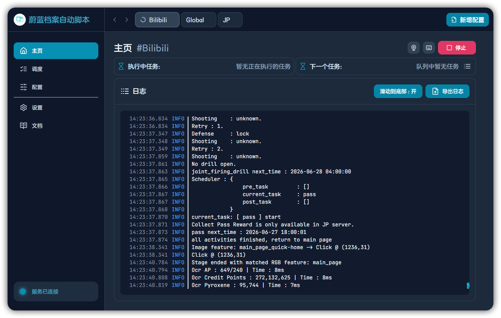
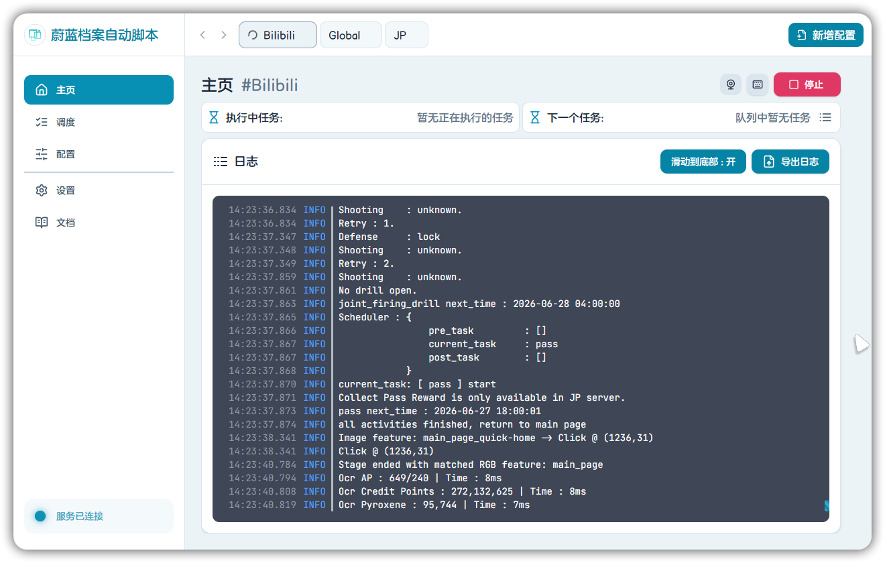
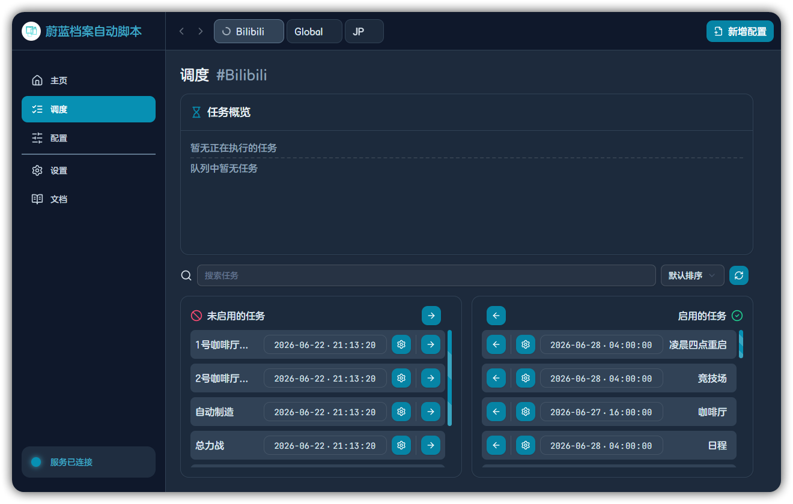
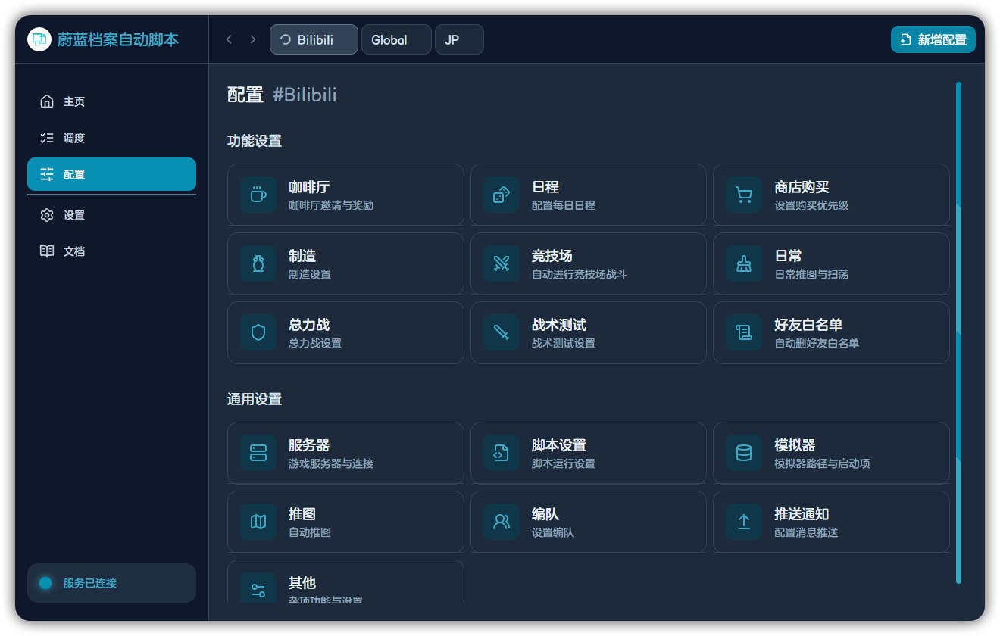
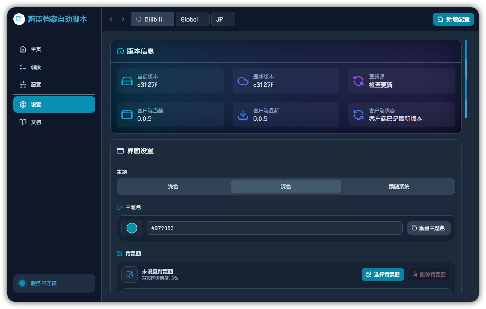

# BAAS Tauri

<p>
  <a href="README.md"><kbd>English README</kbd></a>
  <a href="https://github.com/Kiramei/baas-tauri/releases/latest"><kbd>下载最新版</kbd></a>
  <a href="docs"><kbd>文档站</kbd></a>
  <a href="LICENSE"><kbd>GPL-3.0-only</kbd></a>
</p>

BAAS Tauri 是蔚蓝档案自动化体系的桌面控制台。它把配置档、调度、功能配置、运行日志、远程模拟器画面、更新器和网页文档入口收进一个 Tauri 应用里；BAAS 后端则负责 ADB、截图、识别、模拟器控制和任务执行。

一句话：**Tauri 负责编排，后端负责执行**。你在桌面端管理账号、区服、模拟器、任务策略、日志和文档，后端把这些配置真正跑起来。

<p>
  
</p>

## ✨ 第一眼

| 深色模式                                                                  | 浅色模式                                                                   |
| ------------------------------------------------------------------------- | -------------------------------------------------------------------------- |
|  |  |

## 🧭 它负责什么

| 区域        | 能做什么                                                                                                     |
| ----------- | ------------------------------------------------------------------------------------------------------------ |
| 🗂️ 配置档   | 隔离账号、区服、模拟器实例和任务策略。                                                                       |
| ▶️ 主页     | 启动/停止调度，查看执行中任务、下一个任务、队列、日志、资产和远程画面。                                      |
| 🗓️ 调度     | 启用任务、编辑下次执行时间、搜索、排序、设置间隔、每日重置、前置任务和后置任务。                             |
| 🧩 功能配置 | 配置服务器、模拟器、脚本、推图、扫荡、编队、咖啡厅、日程、商店、制造、战斗、维护和推送。                     |
| 🎛️ 设置     | 调整主题、语言、背景图、UI 缩放、远程解码器、安全流、低性能模式、更新通道、更新源、MirrorC CDK 和 SHA 测试。 |
| 📚 文档     | 在应用内 Wiki 页面加载网页文档站，也可以弹出为普通 Tauri 独立窗口。                                          |

## 🖼️ 截图

| 调度                                                               | 功能配置                                                                   |
| ------------------------------------------------------------------ | -------------------------------------------------------------------------- |
|  |  |

| 远程模拟器                                                                  | 设置与更新                                                                      |
| --------------------------------------------------------------------------- | ------------------------------------------------------------------------------- |
|  |  |

## 📥 下载

安装包发布在 [GitHub Releases](https://github.com/Kiramei/baas-tauri/releases)。下载最新版时，请按你的操作系统和 CPU 架构选择对应文件。

| 系统                        | 安装包                                        |
| --------------------------- | --------------------------------------------- |
| Windows x64                 | `BAAS.Tauri_*_x64-setup.exe`                  |
| Windows ARM64               | `BAAS.Tauri_*_arm64-setup.exe`                |
| Windows x64 固定 WebView2   | `BAAS.Tauri_*_x64_fixed_webview2-setup.exe`   |
| Windows ARM64 固定 WebView2 | `BAAS.Tauri_*_arm64_fixed_webview2-setup.exe` |
| macOS Apple Silicon         | `BAAS.Tauri_*_aarch64.dmg`                    |
| macOS Intel                 | `BAAS.Tauri_*_x64.dmg`                        |
| Linux Debian/Ubuntu         | `BAAS.Tauri_*_amd64.deb` 或 `*_arm64.deb`     |
| Linux Fedora/RHEL           | `BAAS.Tauri_*_x86_64.rpm` 或 `*_aarch64.rpm`  |

文档站中也提供动态下载面板，会读取最新 GitHub Release 并展示可直接下载的安装包。

## 📚 文档站

文档站位于 `docs/`，使用 Fumadocs、Next.js、Mermaid 和仓库内的 Blueaka 字体子集。

```bash
cd docs
bun install
bun run dev
bun run build
```

本地路由：

| 语言    | 地址                             |
| ------- | -------------------------------- |
| 中文    | `http://localhost:3000/docs/zh/` |
| English | `http://localhost:3000/docs/en/` |

维护规则：

- 只维护中文和英文文档。
- 其他应用语言下，文档回退到英文。
- 截图资源按可见内容命名，分别放在 `docs/public/cn` 和 `docs/public/en`。
- GitHub Pages 部署由 `.github/workflows/wiki-pages.yml` 处理。

## 🛠️ 开发

前置条件：

- Bun 1.3 或更高版本。
- 与当前 Vite 和 Next.js 工具链兼容的 Node.js。
- Rust 工具链和 Tauri 2 前置依赖。
- 完整运行交互需要 BAAS 后端服务。

```bash
bun install
bun run dev
bun run dev:tauri
bun run build
bun run build:tauri
bun run lint
```

| 命令                  | 作用                       |
| --------------------- | -------------------------- |
| `bun run dev`         | 启动 Vite 开发服务器。     |
| `bun run dev:tauri`   | 以 Tauri 模式启动前端。    |
| `bun run build`       | 类型检查并构建 Web 资源。  |
| `bun run build:tauri` | 构建 Tauri 模式前端资源。  |
| `bun run lint`        | 执行 ESLint 和 i18n 检查。 |
| `bun run i18n:check`  | 检查多语言键一致性。       |

## 🧱 项目结构

```text
baas-tauri/
├─ src/                    # React 客户端
├─ src-tauri/              # Tauri 2 Rust 外壳、命令、窗口和权限
├─ public/locales/         # 应用 UI 多语言文件
├─ public/docs/            # 旧本地文档兼容内容
├─ docs/                   # Fumadocs 文档站
└─ .github/workflows/      # 发布和文档部署工作流
```

## 📖 Wiki 行为

应用不再把旧本地 Wiki 作为主要文档入口。侧边栏文档页默认加载网页文档站。

在 Tauri 模式下，“独立窗口”会打开普通系统窗口。中文窗口标题为 `百科文档`，英文窗口标题为 `Wiki Docs`。主窗口会显示文档已在独立窗口打开，并提供聚焦独立窗口或回到主窗口的操作。

## 许可证

本项目使用 GPL-3.0-only 协议。详见 [LICENSE](LICENSE)。
