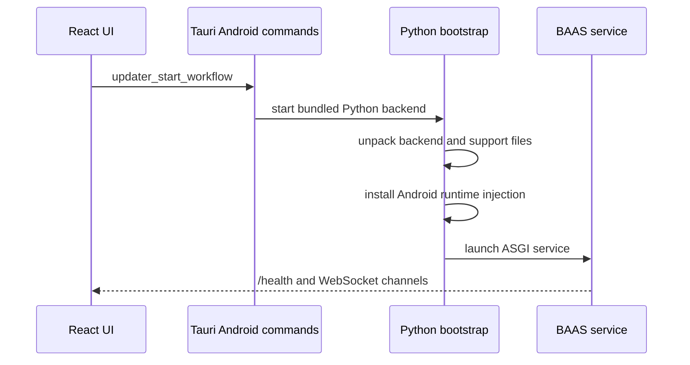

Android builds do not run the desktop uv backend and do not rely on user-selected ADB control methods. The Tauri Android layer starts the bundled Python backend through Chaquopy and locks screenshot, tap, and swipe capabilities to Android-local implementations.

## Startup Flow



## Android-specific Capabilities

| Capability | Entry | Description |
| --- | --- | --- |
| Backend unpack | `android_backend/bootstrap.py` | Unpacks the bundled backend into app storage. |
| Local atx-agent | `_ensure_local_atx_agent` | Prepares a local agent in the Android filesystem. |
| uiautomator2 stub | `_write_uiautomator2_stub` | Provides compatibility APIs mapped to Android-local methods. |
| cv2 compatibility layer | `android_backend/cv2_compat.py` | Provides the image-processing subset that can run on Android. |
| Runtime injection | `android_runtime_injection.py` | Syncs resolution, wraps service injection, and fixes runtime differences. |

## Control Mode

Android runtime config must satisfy:

```toml
screenshot_method = "android_local"
control_method = "android_local"
```

The frontend, Rust commands, and Python side should treat these fields as fixed Android contracts. Do not fall back to desktop ADB screenshot or desktop uiautomator calls on Android. Faster native implementations may be added in Rust, Python, or Kotlin, but they should still expose the external method as `android_local`.

## Where Faster Implementations Belong

If a faster Android-local approach exists, it may be implemented in Rust, Python, or Kotlin, but it must satisfy:

1. Python business logic still calls a stable interface and does not depend on Tauri UI state.
2. The communication protocol is clear and can report errors through `/health` or WebSocket.
3. Frontend config still sees `android_local`.
4. Failures return diagnosable logs instead of freezing the startup page.

## Update Limits

Android code must not assume desktop `uv`, system Python, writable install directories, or pygit2. Backend update commands should return Android-compatible reports. Unsupported Git capabilities must produce explicit errors instead of letting scripts hang silently.
