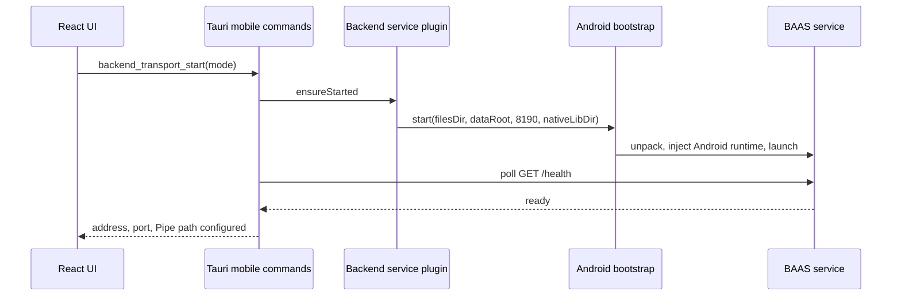

Android embeds Python 3.9 through Chaquopy. A Kotlin foreground-service plugin starts the Python bootstrap, which unpacks the bundled BAAS service into app-private storage and launches it on `127.0.0.1:8190`.

## Startup Flow



The readiness wait is bounded. Missing dependencies or bootstrap failures must appear in `/health`, system logs, or Android logs rather than leaving the setup screen pending indefinitely.

## Transport

Android supports both `pipe` and `websocket`; the default is `pipe`.

- Pipe uses a Unix domain socket returned by the Android backend service plugin.
- `BackendPipeManager` and the TypeScript `TauriPipeConnection` use the same `BPIP` protocol as desktop.
- WebSocket continues to use loopback HTTP/WebSocket service endpoints.
- Changing mode persists `general.transport` without replacing unrelated setup values.

## Storage and Updates

Android setup state lives under application-managed storage. `updater_start_workflow` installs or updates the bundled backend content and returns terminal session metadata. Android does not depend on desktop `uv`, system Python, writable desktop install paths, or `pygit2`.

The config reports:

```toml
[general]
transport = "pipe"

[python]
runtime_path = "embedded-python-3.9"
```

## Android-local Control

Script configuration must keep:

```toml
screenshot_method = "android_local"
control_method = "android_local"
```

The UI, Rust host, and Python compatibility layer all enforce these external values. Native Rust/Kotlin/Python optimizations may change the implementation but not the public method names.

## Platform Differences

| API | Android behavior |
| --- | --- |
| Global shortcuts | Enabled bindings are returned as unsupported/rejected. |
| DevTools command | No-op. |
| Client update check | Reads Android package metadata. |
| MirrorC validation | Returns an Android-compatible unsupported report when unavailable. |
| Virtual display | Uses Android-specific request fields such as `configId` and optional `adbPath`. |
