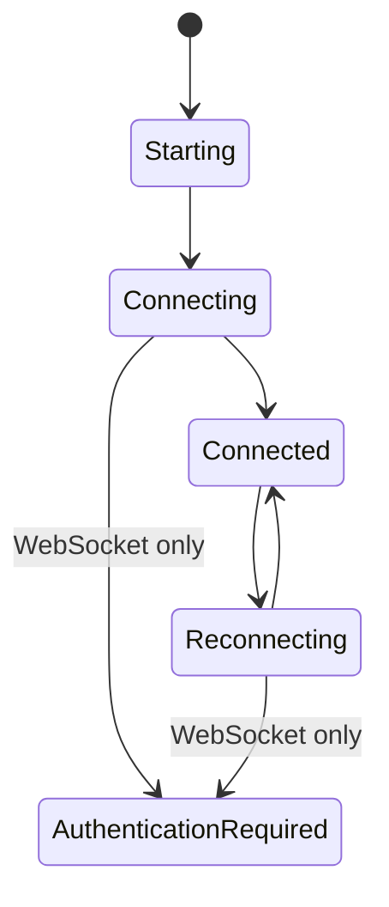

The frontend talks to backend business channels through `BackendConnection`. Pages and stores must not depend on WebSocket-specific methods or invoke Pipe commands directly.

## Connection Interface

```ts
export type BackendChannelName = "provider" | "sync" | "trigger" | "remote";
export type BackendTransportMode = "websocket" | "pipe";

export interface BackendConnection {
  readonly readyState: number | undefined;
  connect(
    onMessage: (message: unknown) => void,
    decodeJson?: boolean,
    decrypt?: boolean,
  ): Promise<void>;
  sendJson(payload: Record<string, unknown>): Promise<void> | void;
  sendBytes(payload: ArrayBuffer | Uint8Array): Promise<void> | void;
  close(): Promise<void> | void;
}
```

Optional `onOpen`, `onClose`, `onError`, and `hookClose` callbacks expose lifecycle changes without leaking a concrete transport.

## Factory Rules

`src/transport/factory.ts` owns mode selection:

1. WebUI always creates `SecureWebSocket`.
2. Native Tauri reads `startup.config.general.transport`.
3. Missing or invalid native values select Pipe.
4. `backend_transport_start` prepares the chosen backend before business channels connect.
5. Pipe creates `TauriPipeConnection`; WebSocket requires a base URL and authenticated session.

## Store Boundary

`src/store/WebsocketStore.ts` keeps its historical name but owns transport-neutral backend state. Page components should consume the store instead of opening `/ws/*` or native endpoints themselves.



Provider, sync, trigger, and remote payload handling must be shared. Only connection setup, framing, and WebSocket authentication belong to adapters.

## Configuration and Android

The setup advanced settings and main settings both write `general.transport`. Android supports both modes and defaults to Pipe. Its script configuration still enforces:

| Field | Android value | UI |
| --- | --- | --- |
| `screenshot_method` | `android_local` | Fixed |
| `control_method` | `android_local` | Fixed |

## Terminal Contract

`TermViewer` restores a structured snapshot immediately, writes incremental chunks to xterm, and calls `updater_resize_term` when dimensions change. Do not replace the terminal with concatenated plain text or wait for the first live chunk before rendering the initial state.

## Compatibility Checklist

- Add copy keys to every locale.
- Keep transport-neutral message handling in stores/shared modules.
- Close stale connections when mode, backend, or component ownership changes.
- Treat Pipe and WebSocket errors as diagnosable connection failures.
- Never expose desktop-only control choices on Android.
