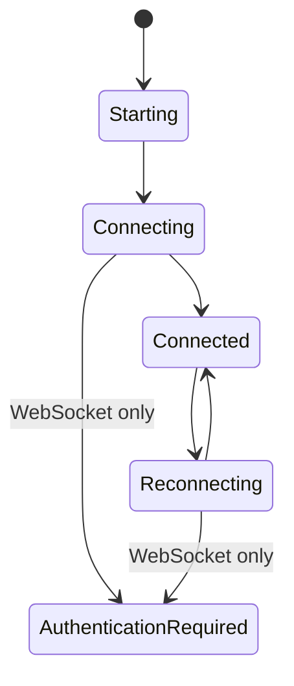

The frontend talks to backend business channels through `BackendConnection`. Pages and stores must not depend on WebSocket-specific methods or invoke Pipe commands directly.

## Connection Interface

```ts
export type BackendChannelName = "provider" | "sync" | "trigger" | "remote";
export type BackendTransportMode = "websocket" | "pipe";
export type BackendRuntimeKind = "python" | "cpp";

export interface BackendConnection {
  readonly readyState: number | undefined;
  connect(
    onMessage: (message: any) => void,
    decodeJson?: boolean,
    decrypt?: boolean,
  ): Promise<void>;
  sendJson(payload: Record<string, unknown>): Promise<void> | void;
  sendBytes(payload: ArrayBuffer | Uint8Array): Promise<void> | void;
  close(): Promise<void> | void;
}
```

Optional `onOpen`, `onClose`, `onError`, and `hookClose` callbacks expose lifecycle changes without leaking a concrete transport.

## Factory Rules

`src/transport/factory.ts` owns runtime and mode normalization:

1. WebUI always creates `SecureWebSocket`; it has no native backend-start command.
2. Android forces runtime `python` and permits Pipe or WebSocket.
3. Desktop Tauri reads one startup snapshot containing runtime and transport, so revisions cannot be mixed.
4. Missing or invalid desktop values select Python + Pipe. Selecting C++ forces WebSocket.
5. Python invokes `backend_transport_start`; desktop C++ invokes `backend_cpp_transport_start`. The latter has no Python fallback.
6. Pipe creates `TauriPipeConnection`; WebSocket requires a base URL and authenticated session.

`startCppBackendTransport()` is a typed desktop helper around the explicit C++ command. It rejects Pipe before invoking Rust. Android rejects C++ before invoking Rust, and the C++ command is not present in the Android command registry.

## Store Boundary

`src/store/WebsocketStore.ts` keeps its historical name but owns transport-neutral backend state. Page components should consume the store instead of opening `/ws/*` or native endpoints themselves.



Provider, sync, trigger, and remote payload handling must be shared. Only connection setup, framing, and WebSocket authentication belong to adapters. During a selection change, the store cancels pending recovery, closes every business connection, clears native Pipe state, activates the chosen backend, authenticates WebSocket when needed, reconnects desired channels, and then resumes initialization.

If native activation fails, Rust rolls the persisted selection back and the store restores its previous runtime/mode. If activation succeeds but later authentication or channel connection fails, the newly activated selection remains authoritative and the store exposes the connection error for retry.

## Configuration and Android

Desktop settings expose Python/C++ runtime selection and transport; choosing C++ disables Pipe. Android supports both transports, defaults to Pipe, and never exposes C++. Its script configuration still enforces:

| Field | Android value | UI |
| --- | --- | --- |
| `screenshot_method` | `android_local` | Fixed |
| `control_method` | `android_local` | Fixed |

## Terminal Contract

`TermViewer` restores a structured snapshot immediately, writes incremental chunks to xterm, and calls `updater_resize_term` when dimensions change. Do not replace the terminal with concatenated plain text or wait for the first live chunk before rendering the initial state.

## Compatibility Checklist

- Add copy keys to every locale.
- Keep transport-neutral message handling in stores/shared modules.
- Close stale connections when mode, backend, or component ownership changes.
- Keep `backend_cpp_transport_start` desktop-only and fail closed; never disguise C++ startup failure as a Python success.
- Treat Pipe and WebSocket errors as diagnosable connection failures.
- Never expose desktop-only control choices on Android.
- Do not add UI for runtime-repository download/activation until a command is explicitly registered and lifecycle-tested.
