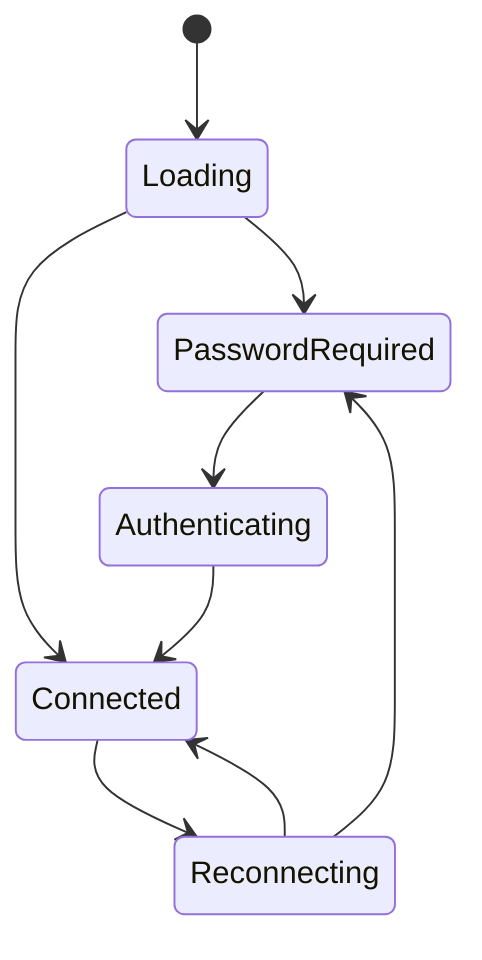

The frontend runtime combines Tauri commands, Service WebSockets, and page components into the user-facing state machine. It is not only a rendering layer; many cross-platform compatibility rules are centralized here.

## Core Modules

| Module | API role | Notes |
| --- | --- | --- |
| `src/store/WebsocketStore.ts` | Backend connection, WebSocket resume, version state, remote display entry | Do not reimplement connection state machines in pages. |
| `src/shared/StorageManager.ts` | localStorage and Tauri storage compatibility wrapper | Desktop prefers Tauri storage; Web falls back to localStorage. |
| `src/shared/I18nTranslator.ts` | Frontend i18n loading and backend locale sync | New copy keys must be added to every locale file. |
| `src/features/ScriptConfig.tsx` | Script runtime config editor | Android locks screenshot and control methods to `android_local`. |
| `src/components/updater/TermViewer.tsx` | Updater terminal view | Must consume chunks and resize through xterm semantics. |

## Connection State

`WebsocketStore` is the single source of truth for backend connection state. Page components should read exposed store state instead of opening `/ws/*` directly.

## Android Fixed Config

Android builds must not expose desktop control methods to users. Config UI should follow this contract:

| Field | Android value | UI behavior |
| --- | --- | --- |
| `screenshot_method` | `android_local` | Display as fixed, no picker. |
| `control_method` | `android_local` | Display as fixed, no picker. |

Saving config should also be defensive: even if an old config or backend snapshot contains desktop methods, Android builds must write back `android_local`.

## Terminal Output

Updater logs must use `TermViewer` and xterm instead of concatenating chunks as plain text. Correct behavior:

1. Rust commands return structured terminal snapshots.
2. The frontend writes incremental chunks to xterm.
3. Resize calls `updater_resize_term`.
4. First-screen restore calls `updater_terminal_snapshot`.

## i18n Rules

When adding frontend copy, update every file under `public/locales`. If a translation is temporarily unavailable, keep a readable English value rather than an empty string, and never let raw keys appear in UI.

## Page Boundary

Page components should render state and trigger actions only. Connection, auth, remote display, terminal, version check, and Android compatibility logic belongs in stores, shared modules, or dedicated components. Otherwise desktop and Android behavior will diverge quickly.
