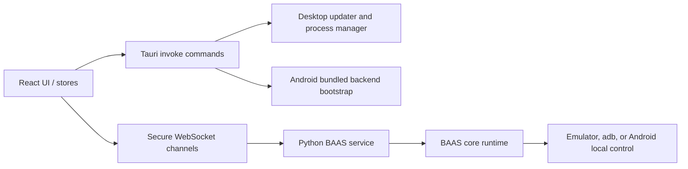

BAAS Tauri has five API boundaries: the React frontend, Tauri commands, desktop/Android launchers, the Python backend service, and the emulator or Android local control layer. Before changing behavior, decide which layer owns the contract: call parameters, startup behavior, config schema, or runtime injection.

## Cross-platform Flow



## API Layers

| Layer | Main entry | Consumer | Maintenance focus |
| --- | --- | --- | --- |
| Frontend runtime | `src/store/WebsocketStore.ts`, pages, config components | React UI | Connection lifecycle, state cache, i18n, Android fixed config |
| Tauri commands | `src-tauri/src/commands.rs`, `mobile_commands.rs`, `behavior.rs` | Frontend `invoke()` | Stable args/results, displayable errors, desktop/Android differences |
| Backend Service | `service.api.*`, `service.injection.*` | Tauri client and remote Web UI | WebSocket resume, auth, config sync, isolated injection |
| Android runtime | `src-tauri/gen/android/.../android_backend` | Android Tauri and Python backend | Local control, Chaquopy startup, compatibility layer, no desktop path assumptions |
| Config and verification | `setup.toml`, app storage, test scripts | All platforms | Schema compatibility, runnable scripts, diagnosable failures |

## Stability Rules

1. Tauri command names are frontend APIs. Renames must migrate every `invoke()` call.
2. WebSocket frame fields such as `type`, `request_id`, `channel`, and `payload` are backend APIs. New fields should remain backward compatible.
3. Android screenshot and control methods must be locked to `android_local`; the UI must not allow users to switch to desktop methods.
4. Service mode must extend upstream behavior from injection points inside the `service` folder. Do not require `main`, `core`, or `module` runtime branches for Service mode.
5. API changes must be verified on desktop, Android, and Python scripts. See [Contracts and Testing](/docs/en/api/contracts-testing) for the minimum matrix.

## Twoslash Example

The following TypeScript snippet uses the docs site's Twoslash highlighting. Hover types are useful when explaining frontend `invoke()` contracts.

```ts twoslash
type TauriCommand<TArgs, TResult> = {
  command: string;
  args: TArgs;
  result: TResult;
};

type TerminalSnapshotRequest = {
  sessionId?: string;
};

type TerminalSnapshot = {
  sessionId: string | null;
  rows: number;
  cols: number;
  regions: Array<{ id: string; lines: string[] }>;
};

const terminalSnapshot: TauriCommand<
  { request: TerminalSnapshotRequest },
  TerminalSnapshot
> = {
  command: "updater_terminal_snapshot",
  args: { request: { sessionId: "active" } },
  result: { sessionId: "active", rows: 24, cols: 80, regions: [] },
};

terminalSnapshot.result.regions[0]?.lines;
```

## Development Guidance

For cross-platform API changes, write the document first and then change code. This fixes parameters, return values, failure modes, and verification scope before desktop and Android implementations drift apart.
