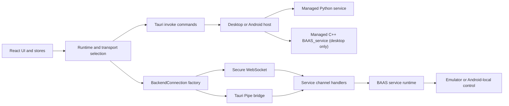

BAAS Tauri exposes four related boundaries: React to Rust through Tauri IPC, React to a selected backend service through a transport adapter, transport-independent business channels, and platform-specific startup/runtime ownership. Treat command names, request fields, channel messages, and Pipe frames as versioned APIs.

The Python runtime remains the default compatibility path. Desktop Tauri can explicitly select the C++ runtime, but that runtime is currently WebSocket-only. Android remains Python-only. WebUI does not launch or own a backend process; it connects to an already running, protocol-compatible WebSocket service.

## Runtime Flow



## API Layers

| Layer | Main entry | Contract |
| --- | --- | --- |
| Frontend transport | `src/transport/types.ts`, `src/transport/factory.ts` | `BackendConnection`, channel names, transport selection |
| Tauri IPC | `src-tauri/src/lib.rs`, `commands.rs`, `mobile_commands.rs` | Registered command names, camel-case arguments, serialized results |
| Pipe bridge | `src-tauri/src/pipe_commands.rs` | Native endpoint lifecycle and `BPIP` frame forwarding |
| Python service | `service/channels`, `service/transport`, `service/api` in `baas-dev` | Default compatibility behavior over Pipe and WebSocket |
| C++ service | `baas-cpp-dev` service application and `backend_cpp_transport_start` | Desktop managed lifecycle and WebSocket protocol parity |
| Android runtime | Rust mobile commands, Kotlin service plugin, Python bootstrap | App-private backend startup, Pipe path, Android-local control |
| Packaging and verification | `scripts/stage-cpp-service.mjs`, frontend tests, CI workflows | Runtime resources, lifecycle gates, and cross-platform compatibility |

## Transport Selection

| Environment and runtime | Default | Available modes |
| --- | --- | --- |
| Desktop Tauri, Python | Python + Pipe | Pipe or WebSocket |
| Desktop Tauri, C++ | Not selected by default | WebSocket only |
| Android Tauri | Python + Pipe | Pipe or WebSocket |
| WebUI | Externally owned service + WebSocket | WebSocket only; no native process-start command |

`resolveBackendSelection()` is the frontend authority. It forces Python on Android and uses Python as a non-owning sentinel in WebUI, forces WebSocket when desktop C++ is selected, and otherwise falls back to Pipe for native clients. The WebUI sentinel does not constrain the implementation of its external service. `backend_transport_start` always activates Python; `backend_cpp_transport_start` is the explicit desktop-only C++ entry.

The Rust runtime-repository activation store is an internal updater building block at this revision. No runtime-repository git2 downloader, Tauri activation command, or frontend route is registered yet.

## Stability Rules

1. A Tauri command rename must migrate every `invoke()` caller on desktop and Android.
2. Provider, sync, trigger, and remote contracts must stay compatible across Python and C++, with transport-specific gaps documented explicitly.
3. Additive JSON fields are preferred. Existing message types and correlation fields must remain readable.
4. Pipe frame magic, version, kinds, byte order, and size limits are protocol constants.
5. Android keeps `screenshot_method` and `control_method` fixed to `android_local`.
6. A failed native activation must stop the rejected child, close stale Pipe connections, and restore the previous selection.
7. Update both languages and run the verification matrix in [Contracts and Testing](/docs/en/api/contracts-testing).

## Typed Invoke Example

```ts twoslash
type BackendRuntimeKind = "python" | "cpp";
type BackendTransportMode = "websocket" | "pipe";

type BackendReady = {
  baseBackendAddr: string;
  baseBackendPort: number;
};

declare function invoke<TResult>(
  command: string,
  args?: Record<string, unknown>,
): Promise<TResult>;

const runtime: BackendRuntimeKind = "cpp";
const command =
  runtime === "cpp" ? "backend_cpp_transport_start" : "backend_transport_start";
const ready = await invoke<BackendReady>(command, {
  mode: "websocket" satisfies BackendTransportMode,
});

ready.baseBackendPort;
```
