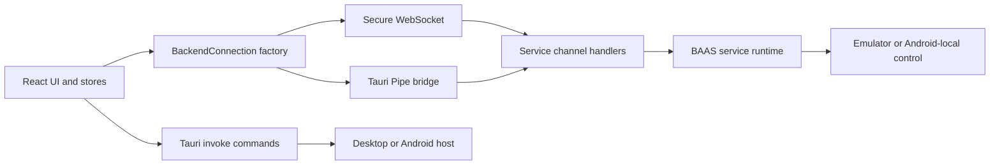

BAAS Tauri exposes four related boundaries: React to Rust through Tauri IPC, React to the Python service through a transport adapter, transport-independent service channels, and platform-specific startup/runtime code. Treat command names, request fields, channel messages, and Pipe frames as versioned APIs.

## Runtime Flow



## API Layers

| Layer | Main entry | Contract |
| --- | --- | --- |
| Frontend transport | `src/transport/types.ts`, `src/transport/factory.ts` | `BackendConnection`, channel names, transport selection |
| Tauri IPC | `src-tauri/src/lib.rs`, `commands.rs`, `mobile_commands.rs` | Registered command names, camel-case arguments, serialized results |
| Pipe bridge | `src-tauri/src/pipe_commands.rs` | Native endpoint lifecycle and `BPIP` frame forwarding |
| Service transport | `service/channels`, `service/transport`, `service/api` in `baas-dev` | Shared provider, sync, trigger, and remote behavior |
| Android runtime | Rust mobile commands, Kotlin service plugin, Python bootstrap | App-private backend startup, Pipe path, Android-local control |
| Config and verification | `setup.toml`, frontend tests, CI workflows | Defaults, migrations, cross-platform compatibility |

## Transport Selection

| Runtime | Default | Available modes |
| --- | --- | --- |
| Desktop Tauri | Pipe | Pipe or WebSocket |
| Android Tauri | Pipe | Pipe or WebSocket |
| WebUI | WebSocket | WebSocket only |

The native selection is stored at `general.transport`. Missing or invalid native values fall back to `pipe`; WebUI never tries to invoke native Pipe commands.

## Stability Rules

1. A Tauri command rename must migrate every `invoke()` caller on desktop and Android.
2. Provider, sync, trigger, and remote handlers must behave the same through Pipe and WebSocket.
3. Additive JSON fields are preferred. Existing message types and correlation fields must remain readable.
4. Pipe frame magic, version, kinds, byte order, and size limits are protocol constants.
5. Android keeps `screenshot_method` and `control_method` fixed to `android_local`.
6. Update both languages and run the verification matrix in [Contracts and Testing](/docs/en/api/contracts-testing).

## Typed Invoke Example

```ts twoslash
type BackendTransportMode = "websocket" | "pipe";

type BackendReady = {
  baseBackendAddr: string;
  baseBackendPort: number;
};

declare function invoke<TResult>(
  command: string,
  args?: Record<string, unknown>,
): Promise<TResult>;

const ready = await invoke<BackendReady>("backend_transport_start", {
  mode: "pipe" satisfies BackendTransportMode,
});

ready.baseBackendPort;
```
