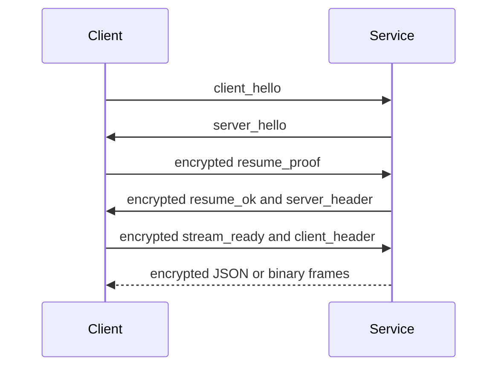

The Python service exposes provider, sync, trigger, and remote handlers through transport-neutral `ChannelEndpoint` adapters. The C++ service implements the same public WebSocket routes and BPIP framing in `baas-cpp-dev`. At the Tauri integration boundary, Python supports both adapters, while the C++ launcher currently enables WebSocket only.

## Endpoints

| Transport | Entry | Availability |
| --- | --- | --- |
| HTTP identity/lifecycle | `GET /version`, `GET /health`, `POST /shutdown` | C++ managed-service identity, readiness, and graceful shutdown; health also exists on Python. |
| HTTP authentication | `POST /auth/remember`, `POST /auth/logout` | WebSocket session support. |
| WebSocket control | `/ws/control` | Authentication, resume, heartbeat, and password management. |
| WebSocket business | `/ws/provider`, `/ws/sync`, `/ws/trigger`, `/ws/remote` | Python, C++, WebUI, and native WebSocket mode. |
| Native Pipe | Windows named pipe or Unix domain socket | Python desktop and Android integration. C++ has BPIP service support, but Tauri does not select it yet. |

## Shared Business Channels

| Channel | Handler responsibility |
| --- | --- |
| `provider` | Logs, runtime status, static and status requests. |
| `sync` | Config snapshots, patches, filesystem events, and persisted state. |
| `trigger` | Commands and correlated `command_response` messages. |
| `remote` | Remote-display binary/control traffic. |

Adding behavior to only one Python transport adapter is a contract violation. A C++ implementation is compatible only after its externally visible message shape, correlation values, binary ordering, and error behavior pass the same contract tests; sharing route names alone is insufficient.

## WebSocket Session

WebSocket business channels authenticate through `/ws/control`, then resume an encrypted session. Reconnect attempts resume before requesting a new password flow.



## Pipe Protocol

Each native business connection starts with a JSON frame:

```json
{"type":"open","channel":"provider"}
```

The service replies with `{"type":"open_ok","channel":"provider"}` before normal traffic.

The 10-byte little-endian header uses `struct <4sBBI`:

| Offset | Size | Value |
| --- | --- | --- |
| 0 | 4 | Magic `BPIP` |
| 4 | 1 | Version `1` |
| 5 | 1 | Kind: JSON `1`, bytes `2`, close `3`, error `4` |
| 6 | 4 | Payload length, unsigned little-endian |

Payloads are limited to 64 MiB. Windows uses a named pipe; Unix platforms, including Android, use a Unix domain socket. The Unix socket is created with owner-only permissions. Tauri also enforces a bounded open handshake, cancellation by `clientAttempt`, and an opaque ownership token on every send and close.

## Runtime and Process Lifecycle

| Runtime | Host command | Readiness | Shutdown ownership |
| --- | --- | --- | --- |
| Python desktop | `backend_transport_start` | Authentication endpoint becomes available | Managed PID record and Python stop path |
| C++ desktop | `backend_cpp_transport_start` | Exact v1 `/version` identity plus ready `/health` | Managed PID identity; graceful `/shutdown` where applicable, then bounded cleanup |
| Python Android | `backend_transport_start` | Kotlin/Chaquopy service plus bounded `/health` poll | Android foreground-service owner |
| WebUI | none | The browser connects to an external WebSocket endpoint | External owner |

The packaged C++ executable must be named exactly `BAAS_service` (`BAAS_service.exe` on Windows), pass `--version`, and run with the selected project root on loopback. The separately owned remote jar is staged as `ws-scrcpy-server.jar`. These are packaging resources; dynamic BAAS runtime repositories are not a frontend command at this revision.

## Failure Contract

| Failure | Expected response |
| --- | --- |
| Invalid magic/version/kind or oversized payload | Close connection with a protocol error. |
| Unknown channel or invalid first frame | Send an error frame and close. |
| WebSocket auth/resume failure | Clear or renew session through control flow. |
| Sync patch conflict | Return/reload the authoritative snapshot; do not silently disable sync. |
| Remote unavailable | Reject the channel/action with a readable reason. |
| Backend startup failure | Surface readiness and dependency detail through `/health` and host logs. |
| Native activation failure | Stop the rejected child, close stale transport state, and restore the prior selection; never silently fall back from C++ to Python. |
