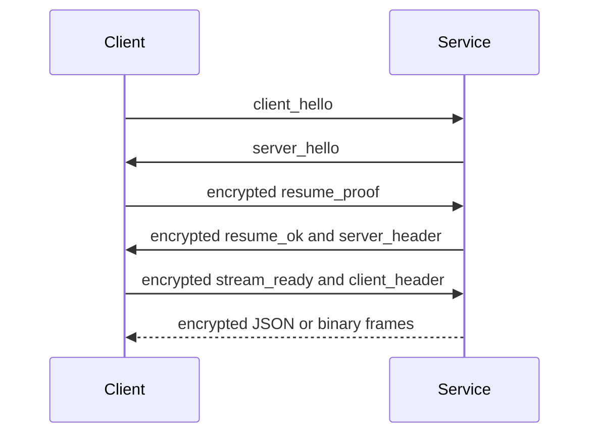

The Python service exposes the same provider, sync, trigger, and remote handlers through two adapters. Business logic depends on the `ChannelEndpoint` protocol, not FastAPI WebSocket or OS Pipe objects.

## Endpoints

| Transport | Entry | Availability |
| --- | --- | --- |
| HTTP | `GET /health`, `POST /auth/remember`, `POST /auth/logout` | All modes; health is also used for readiness. |
| WebSocket control | `/ws/control` | WebSocket authentication, resume, heartbeat, password management. |
| WebSocket business | `/ws/provider`, `/ws/sync`, `/ws/trigger`, `/ws/remote` | WebUI and native WebSocket mode. |
| Native Pipe | Windows named pipe or Unix domain socket | Desktop and Android native Pipe mode. |

## Shared Business Channels

| Channel | Handler responsibility |
| --- | --- |
| `provider` | Logs, runtime status, static and status requests. |
| `sync` | Config snapshots, patches, filesystem events, and persisted state. |
| `trigger` | Commands and correlated `command_response` messages. |
| `remote` | Remote-display binary/control traffic. |

Adding behavior to one transport adapter but not the channel handler is a contract violation.

## WebSocket Session

WebSocket business channels authenticate through `/ws/control`, then resume an encrypted session. Reconnect attempts resume before requesting a new password flow.



## Pipe Protocol

Each native business connection starts with a JSON frame:

```json
{"type":"open","channel":"provider"}
```

The service replies with `{"type":"open_ok","channel":"provider"}` before normal traffic.

The 10-byte little-endian header uses `struct <4sBBI`:

| Offset | Size | Value |
| --- | --- | --- |
| 0 | 4 | Magic `BPIP` |
| 4 | 1 | Version `1` |
| 5 | 1 | Kind: JSON `1`, bytes `2`, close `3`, error `4` |
| 6 | 4 | Payload length, unsigned little-endian |

Payloads are limited to 64 MiB. Windows uses a named pipe; Unix platforms, including Android, use a Unix domain socket. The Unix socket is created with owner-only permissions.

## Failure Contract

| Failure | Expected response |
| --- | --- |
| Invalid magic/version/kind or oversized payload | Close connection with a protocol error. |
| Unknown channel or invalid first frame | Send an error frame and close. |
| WebSocket auth/resume failure | Clear or renew session through control flow. |
| Sync patch conflict | Return/reload the authoritative snapshot; do not silently disable sync. |
| Remote unavailable | Reject the channel/action with a readable reason. |
| Backend startup failure | Surface readiness and dependency detail through `/health` and host logs. |
