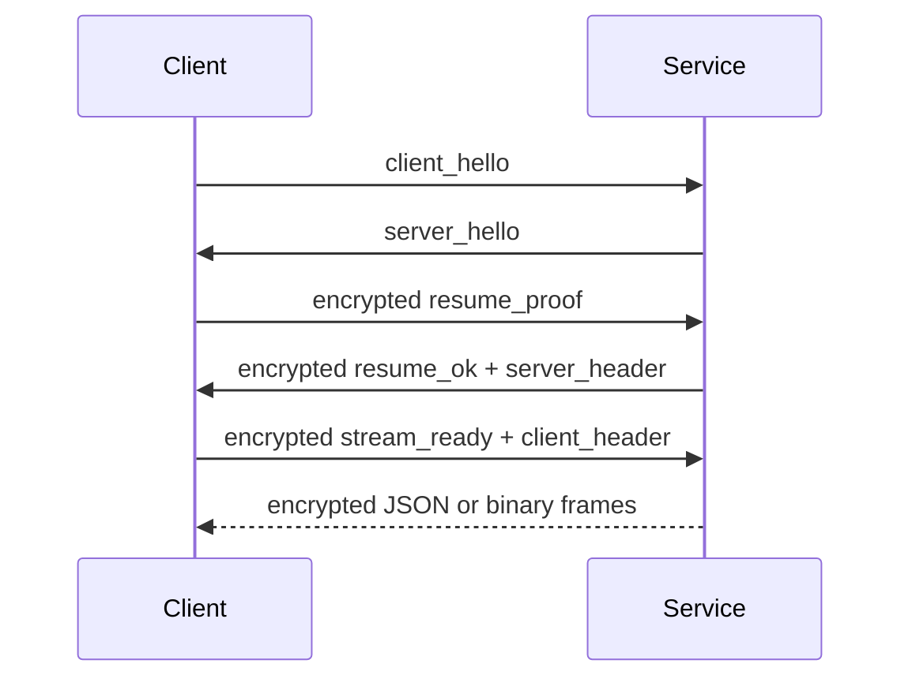

Service mode provides the backend API shared by the Tauri client and Web UI. See [Backend Service](/docs/en/reference/backend-service) for module-level detail; this page records the stable contracts developers should depend on.

## HTTP Entries

| Endpoint | Method | Auth | Purpose |
| --- | --- | --- | --- |
| `/health` | `GET` | none | Reports service liveness, auth state, and Android compatibility errors. |
| `/auth/remember` | `POST` | remember proof | Exchanges a remember cookie. |
| `/auth/logout` | `POST` | cookie | Clears the remember cookie. |

`/health` must stay lightweight because the startup page polls it repeatedly. On Android, missing Python dependencies or compatibility-layer failures should also be reported through `/health` as the first readable error.

## WebSocket Entries

| Endpoint | Channel | Content | Encryption |
| --- | --- | --- | --- |
| `/ws/control` | control | handshake, auth, resume, heartbeat, password changes | encrypted after handshake |
| `/ws/sync` | sync | config snapshots, JSON patches, filesystem events | encrypted after resume |
| `/ws/provider` | provider | logs, runtime status, static state requests | encrypted after resume |
| `/ws/trigger` | trigger | frontend commands and `command_response` frames | encrypted after resume |
| `/ws/remote` | remote | scrcpy remote display proxy | depends on session capability |

## Resume Flow

Business channels must not bypass control-channel authentication. On reconnect, the frontend should attempt resume first, then fall back to full auth only after resume fails.

## JSON Frame Contract

| Field | Type | Description |
| --- | --- | --- |
| `type` | `string` | Frame type, for example `config_snapshot`, `command_response`, or `log_chunk`. |
| `request_id` | `string?` | Request/response correlation ID. Commands that expect responses must include it. |
| `channel` | `string?` | Business channel name for logs and diagnostics. |
| `payload` | `object?` | Business data. New fields should be backward compatible. |
| `error` | `object?` | Structured error. Must include at least `message`. |

## Failure Modes

| Scenario | Backend behavior | Frontend behavior |
| --- | --- | --- |
| Cookie expired | control returns auth failure | Clear session and ask for password |
| Resume token expired | close channel or return resume failure | Re-run control authentication |
| Config patch conflict | return current snapshot or explanatory error | Reload config instead of blind local write |
| Android dependency missing | expose dependency through `/health` | Show readable startup log |
| Remote unavailable | reject or close `/ws/remote` | Disable remote display action |

## Service Isolated Injection

Service mode extensions must stay inside the `service` folder, for example through `service.injection.apply_service_injections`. Do not require `core`, `module`, or `main` to add Service-specific runtime branches. When Android runtime needs to wrap injection, wrap the service injection function instead of patching scattered upstream code paths.
