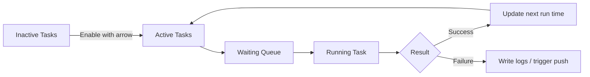

The Scheduler decides which automation tasks run for the current profile and when they run. Configuration pages decide how a task behaves; the Scheduler decides whether it runs, when it runs, and how it depends on other tasks.

## Layout

The page contains:

- Task overview: running task and waiting queue.
- Search: filter tasks by name.
- Sort selector: default order or time order.
- Refresh button: set all next run times to now.
- Inactive tasks: tasks not scheduled.
- Active tasks: tasks included in the scheduler queue.

## Enable and Disable

Use row arrow buttons to move a task between inactive and active columns. Column header arrows move all tasks.

Enable only tasks that are configured and valid for the current account. Cafe, mail, and reward collection are usually lower risk. Shop, sweeps, arena, events, and combat tasks may consume resources or attempts.

## Next Run Time

The date-time control on each row sets the task's next run time. The refresh button resets every task to now.

Notes:

- Detailed scheduling can also define interval, daily reset, disabled range, pre-task, and post-task.
- Refreshing a completed task to now can make it run again soon.
- Refreshing many high-cost tasks may consume AP, tickets, or challenge attempts in sequence.

## Detailed Task Scheduling

Click the gear button on a task row to open detailed scheduling.

| Field          | Purpose                                | Common Use                                |
| -------------- | -------------------------------------- | ----------------------------------------- |
| Priority       | Used by default sorting                | Run low-risk daily tasks first            |
| Interval       | Seconds before the task can run again  | Prevent frequent repeats                  |
| Daily reset    | Daily reset point                      | Once-per-day tasks                        |
| Disabled range | Time range where task will not trigger | Avoid maintenance or manual play          |
| Pre-task       | Tasks that must finish first           | Collect AP before sweeps                  |
| Post-task      | Tasks that follow this one             | Send push or collect rewards after sweeps |

## Task List

The scheduler may include:

- Daily basics: cafe, cafe invitations, lessons, shop, mail, rewards, group AP, pass rewards.
- AP and sweeps: normal stages, hard stages, bounty, scrimmage, special task, activity sweep.
- Stage and story: normal stage, hard stage, main story, mini story, group story, event story, event mission, event challenge.
- Combat events: arena, tactical challenge shop, Total Assault, Joint Firing Drill, daily game activity.
- Maintenance: MomoTalk, friend cleanup, crafting, free AP collection, daily AP collection, 4 AM restart, anti-harmony.

## Recommended Enable Order

1. Cafe, mail, rewards.
2. Lessons, shop, group AP.
3. Normal/hard sweeps, bounty, scrimmage, special task.
4. Crafting, MomoTalk, friend cleanup.
5. Arena, Total Assault, Joint Drill, events, and stage pushing.

Run once and check logs after each step.

<Callout type="idea" title="A Full Queue Is Not Always Better">
  Enabling every task at once makes failures hard to isolate. Add 2-3 tasks at a time, validate,
  then expand.
</Callout>
