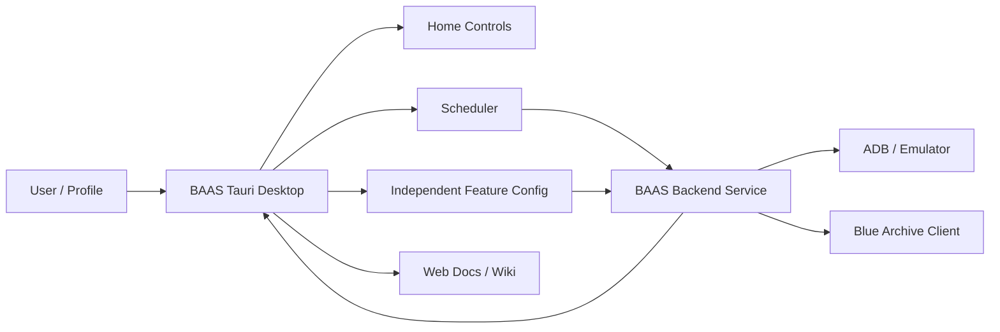

  <section className="baas-doc-hero">
    

      

        
        Blue Archive Auto Script
      

      <h2>A desktop workbench for controlled Blue Archive automation</h2>
      

        BAAS Tauri manages profiles, scheduling, logs, remote emulator display, updates, and
        documentation. The backend handles ADB, screenshots, recognition, task execution, and state
        synchronization.
      

      

        <a href="#download">Download</a>
        <a href="./guide/install">Install</a>
        <a href="./guide/interface">Interface</a>
        <a href="./features/server">Configure</a>
      

    

    <figure className="baas-doc-hero-shot">
      
      <figcaption>
        BAAS Tauri Home: navigation, profile shortcuts, task status, logs, and run controls.
      </figcaption>
    </figure>
  </section>

<ReleaseDownloadPanel locale="en" />

  
⚠️ macOS Requires Manual Approval

  

    

      BAAS Tauri macOS packages are not Apple-notarized. If macOS says the developer cannot be verified, the app is damaged,
      or the app should be moved to Trash, confirm that the file came from official GitHub Releases first, then follow the
      macOS notes in <a href="./guide/install#download-the-desktop-installer">Installation and Connection</a>.
    

  

<Callout type="info" title="Start Here">
  BAAS is split into orchestration and execution: the desktop client coordinates, while the backend
  performs device control and automation. When something goes wrong, inspect profiles, scheduler
  state, ADB, recognition, and logs first.
</Callout>

  

    <strong>🧭 Entry Points</strong>Home, Scheduler, Configuration, Settings, and Docs.
  

  

    <strong>🧩 Profiles</strong>Separate accounts, servers, emulators, and strategies.
  

  

    <strong>🧪 Validation</strong>Start with low-risk tasks before resource-spending tasks.
  

  

    <strong>📚 Languages</strong>Only Chinese and English are maintained.
  

## Reading Path

| Scenario              | Read First                                     | Confirm                                          |
| --------------------- | ---------------------------------------------- | ------------------------------------------------ |
| First installation    | [Installation and Connection](./guide/install) | Backend started, key accepted, service connected |
| First main-window use | [Interface Overview](./guide/interface)        | Profiles, logs, remote display, sidebar          |
| Daily automation      | [Scheduler](./guide/scheduler)                 | Enabled tasks, next run time, dependencies       |
| Feature setup         | Individual feature pages below                 | Resource cost and validation method              |
| Something broke       | [Troubleshooting](./reference/troubleshooting) | Logs, screenshots, profile, server, emulator     |

## Feature Configuration

  <a href="./features/profile">
    <strong>🗂️ Profiles</strong>
    Create, copy, import, export, and remove profiles.
  </a>
  <a href="./features/home-runtime">
    <strong>▶️ Home Runtime</strong>
    Start, stop, queue, logs, assets, and remote display.
  </a>
  <a href="./features/server">
    <strong>🌐 Server</strong>
    CN, Global, JP, and server-specific behavior.
  </a>
  <a href="./features/emulator">
    <strong>📱 Emulator</strong>
    Executable path, launch delay, multi-instance, and ADB.
  </a>
  <a href="./features/script">
    <strong>🧾 Script</strong>
    Backend launch options, screenshot method, and control method.
  </a>
  <a href="./features/pc-platform">
    <strong>🖥️ PC Client</strong>
    Steam Global, JP PC, HDR, window ratio, and desktop control.
  </a>
  <a href="./features/stages">
    <strong>🗺️ Stages</strong>
    Normal, hard, story, and event stages.
  </a>
  <a href="./features/sweeps">
    <strong>⚡ Sweeps</strong>
    Daily maps, commissions, scrimmage, events, and tickets.
  </a>
  <a href="./features/team">
    <strong>👥 Teams</strong>
    Sidebar order, preset teams, and attack-type teams.
  </a>
  <a href="./features/cafe">
    <strong>☕ Cafe</strong>
    Invite students, collect rewards, and handle cafe actions.
  </a>
  <a href="./features/lesson">
    <strong>🏫 Lessons</strong>
    Areas, tickets, priority, and lesson sweep strategy.
  </a>
  <a href="./features/shop">
    <strong>🛒 Shop</strong>
    Normal, arena, raid, expert permit, and other shops.
  </a>
  <a href="./features/crafting">
    <strong>🏭 Crafting</strong>
    Node choices, material input, and result collection.
  </a>
  <a href="./features/combat">
    <strong>⚔️ Combat</strong>
    Arena, Total Assault, Joint Drill, and high-risk combat tasks.
  </a>
  <a href="./features/maintenance">
    <strong>🧰 Maintenance</strong>
    Friends, notifications, launch game, rewards, and helper tasks.
  </a>
  <a href="./features/system">
    <strong>🎛️ System Settings</strong>
    Theme, language, zoom, background, remote display, and hotkeys.
  </a>
  <a href="./features/update">
    <strong>🔄 Updates</strong>
    Backend updates, client updates, mirrors, channels, and SHA tests.
  </a>
  <a href="./reference/setup-toml">
    <strong>🧷 Installer Config</strong>
    setup.toml, MirrorC CDK, update sources, and backend install options.
  </a>
  <a href="./reference/backend-service">
    <strong>🔌 Backend Service</strong>
    HTTP, WebSocket, auth, config sync, and remote-display interfaces.
  </a>
  <a href="./reference/auto-fight-dev">
    <strong>🤖 Auto Fight Dev</strong>
    Workflows, state machines, template matching, OCR, and assets.
  </a>

## Maintenance Model

The old local Wiki is no longer the primary documentation surface. The canonical source is `baas-tauri/docs`, generated by Fumadocs. The Tauri Docs page loads this web documentation site by default and can detach it into a standalone "Wiki Documentation" window.
