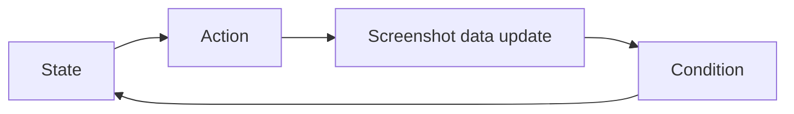

This page is migrated from the legacy `develop_doc/script/auto_fight.md`, `game_feature.md`, `screenshot.md`, and `ocr.md`. It explains how the backend extracts state from screenshots and executes combat workflows.

<Callout type="warn" title="Development reference">
  Normal users only need to configure tasks in the Tauri client. This page is for backend auto-fight
  workflows, recognition assets, and source maintenance.
</Callout>

## Auto Fight Model

BAAS auto fight is not the game's built-in Auto blindly casting skills. Instead, it:

1. Captures screenshots continuously.
2. Extracts cost, skills, HP, timers, positions, and other data.
3. Evaluates conditions from a user-defined workflow.
4. Releases skills or performs restart/end actions in the right state.

The legacy docs describe this as a finite-state machine:

Workflow files are JSON and contain three core object types:

| Object      | Purpose                                                             |
| ----------- | ------------------------------------------------------------------- |
| `state`     | Current flow node; executes an action and transitions by conditions |
| `action`    | Cast skill, restart, wait, toggle Auto, or another operation        |
| `condition` | HP, cost, skill name, timeout, and composed predicates              |

## Observable Combat Data

Auto fight maintains screenshot-derived data that actions and conditions can read:

| Data                     | Usage                                     |
| ------------------------ | ----------------------------------------- |
| Boss current/max HP      | HP workflows, kill checks, restart checks |
| Skill-slot student names | Detect whether a target skill appears     |
| Skill cost               | Decide whether a skill can be cast        |
| Current cost             | Timing control                            |
| Speed / Auto state       | Confirm combat state                      |
| Fight remaining time     | Timeout and phase checks                  |
| Room remaining time      | Total Assault and timed modes             |
| Student/enemy positions  | Targeting, area skills, YOLO detection    |

## Screenshot and Control Performance

Legacy screenshot-method guidance:

| Method              | Notes                                                      |
| ------------------- | ---------------------------------------------------------- |
| `nemu`              | Fast and lossless for MuMu 12; usually worth testing first |
| `scrcpy`            | Fast, but not lossless                                     |
| `adb`               | Stable but slower                                          |
| `uiautomator2`      | Stable but slower                                          |
| `mss` / `pyautogui` | PC-client window capture                                   |

Performance varies by device and emulator. Auto fight, remote display, and daily tasks have different latency needs; do not blindly reuse one task's best setting for every scenario.

## Template Matching

Template matching fits static images: buttons, icons, fixed UI elements, shop entries. It is CPU-friendly and can run in milliseconds. Its weakness is sensitivity to scale, rotation, color, and screenshot ratio.

Common function roles:

| Function                        | Purpose                                                               |
| ------------------------------- | --------------------------------------------------------------------- |
| `compare_image`                 | Match a fixed screenshot region against a template                    |
| `search_in_area`                | Search a template inside a region and return best position/confidence |
| `search_image_in_area`          | Search with a runtime-provided template image                         |
| `get_image_all_appear_position` | Return all positions above threshold                                  |
| `swipe_search_target_str`       | Swipe until a target string or image appears                          |

## OCR

OCR recognizes text, numbers, HP, cost, event names, and other dynamic information that cannot be handled reliably by static templates. The legacy OCR service supported:

- Multiple language models.
- Single-line OCR.
- General OCR.
- Text-box detection.
- Local image, remote image, or shared-memory transfer.

OCR costs more than template matching. Prefer templates for stable static UI; use OCR for text, numbers, and dynamic content.

## Recognition Asset Maintenance

When adding or updating recognition assets, confirm:

| Item                | Requirement                                        |
| ------------------- | -------------------------------------------------- |
| Resolution          | Prefer standard 16:9 screenshots, ideally 1280x720 |
| Format              | Use lossless PNG                                   |
| Language and server | Match the target server resource directory         |
| Occlusion           | Avoid cursor, popups, and notifications            |
| Naming              | Use semantic names, not temporary screenshot names |
| Validation          | Test on the target server and a clean profile      |

If recognition fails only on the PC client, check HDR, window ratio, screenshot method, and control method before recapturing templates.
