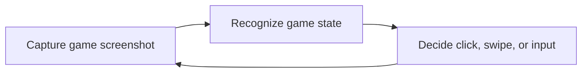

This page consolidates the legacy `develop_doc/env.md`, `develop_doc/log.md`, and development overview for backend contributors and Tauri/backend integration maintainers.

## Development Environment

Recommended editors:

- PyCharm
- VS Code

Use the Python version required by the current backend repository. The legacy docs used Python `3.9.21`:

```bash
conda create -n baas_env python=3.9.21
conda activate baas_env
pip install -r requirements.txt
```

On Linux/macOS, use the backend project's current file, such as `requirements-linux.txt`. If the project has moved to `uv` or `pdm`, follow the current lockfile and README.


## Backend Control Loop

The legacy development docs summarize BAAS task execution as:



The Tauri client does not execute this loop directly. It owns configuration, scheduling UI, logs, and status display; the backend owns screenshots, recognition, control, and task logic.

## Logging Rules

The legacy backend `Logger` lives in `core/utils.py`. Logs are sent to the UI or terminal. Static log strings should be written in English to help cross-language users and developers debug issues.

| Level | Use Case |
| ----- | -------- |
| `info` | Normal runtime status |
| `warning` | Abnormal state that can be recovered automatically |
| `error` | Current task cannot recover; restart task or stop BAAS |
| `critical` | Invalid parameters, startup failure, or task cannot run |
| `line` | Separate task contexts |

```python
self.logger.info("Info Message")
self.logger.warning("Warning Message")
self.logger.error("Error Message")
self.logger.critical("Critical Message")
self.logger.line()
```

## Configuration Maintenance

Backend config commonly covers:

- Emulator connection: ADB IP, ADB port, multi-instance number.
- Screenshot and control methods: `nemu`, `adb`, `uiautomator2`, `scrcpy`, `mss`, `pyautogui`, and others.
- Feature parameters: cafe, lessons, crafting, stages, sweeps, shops, arena.
- Scheduler parameters: enabled state, interval, daily reset, disabled windows, pre-tasks, post-tasks.
- Resource state: AP, credits, pyroxene, tickets, shop coins.
- Push settings: ServerChan, Feishu, custom JSON webhook.

When adding a config key, update:

| Area | Required Work |
| ---- | ------------- |
| Backend defaults | Default value and migration logic |
| Tauri UI | Form control, validation, copy |
| Scheduler | Whether it affects enablement or timing |
| Docs | Chinese and English descriptions |
| Logs | Debuggable English log messages |

## Documentation Boundary

Backend development details belong in `reference`; normal user workflows belong in `guide` and `features`. Avoid putting source-level member lists into user pages; user pages should explain runtime impact and validation.
