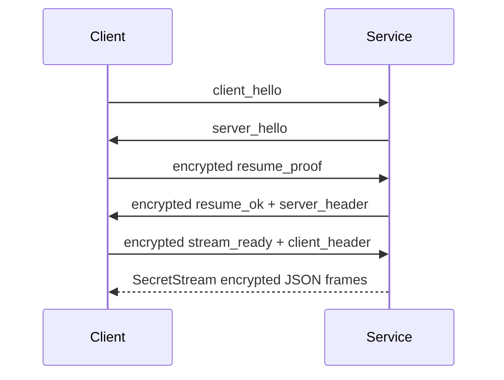

This page is migrated from `baas-dev/docs/develop_doc/service_mode.md` for developers maintaining Tauri-to-backend communication.

## Entry Point

The stable Service-mode entry command is:

```bash
python main.service.py --host 0.0.0.0 --port 8190 --log-level info
```

The ASGI entrypoint is `service.app:app`. It assembles FastAPI, CORS, lifespan, and route modules. Long-lived dependencies are stored in `service.api.state.context`.

## Module Ownership

| Module | Responsibility |
| ------ | -------------- |
| `service/api/http.py` | remember/logout and health |
| `service/api/ws_control.py` | control-channel auth, heartbeat, password change, auth revocation |
| `service/api/ws_sync.py` | config/event/gui/setup snapshots, JSON patch, config list, filesystem pushes |
| `service/api/ws_provider.py` | logs, runtime status, static requests, status requests |
| `service/api/ws_trigger.py` | command-response WebSocket |
| `service/api/commands.py` | dispatch trigger messages into `ServiceRuntime` |
| `service/api/ws_remote.py` | scrcpy remote-display WebSocket proxy |
| `service/api/security.py` | origin policy, encrypted JSON frames, control auth, business-channel resume |
| `service/auth/` | password state, sessions, remember tokens, signing keys, secretstream transport |
| `service/conf/` | safe config paths, initialization, resource lookup, snapshots, patching, filesystem watching |
| `service/update/` | `setup.toml`, remote SHA checks, CDK validation, update execution |
| `service/remote/` | scrcpy client, server jar, proxy callbacks, cleanup |

## Public Interfaces

HTTP:

| Endpoint | Purpose |
| -------- | ------- |
| `POST /auth/remember` | Verify remember-session proof and set `baas_remember` |
| `POST /auth/logout` | Delete `baas_remember` |
| `GET /health` | Return service status and public auth state |

WebSocket:

| Endpoint | Purpose |
| -------- | ------- |
| `/ws/control` | `client_hello`, `server_hello`, initialize, authenticate, resume, heartbeat |
| `/ws/sync` | config snapshots, patches, config list, filesystem pushes |
| `/ws/provider` | initial logs, runtime status, static/status requests |
| `/ws/trigger` | accept commands and return `command_response` |
| `/ws/remote` | remote-display scrcpy proxy with encrypted or plain bytes |

`/ws/remote_test` was a debug endpoint and has been removed.

## Business WebSocket Resume Flow



All business channels share this resume pattern. When changing Tauri connection logic, keep control-channel authentication separate from business-channel resume.

## Development Checks

After backend interface changes, run at least:

```bash
python -m compileall -q service
python -m pytest tests/service
```

Compatibility checks should cover:

```python
from service.auth import ServiceAuthManager
from service.conf.manager import ConfigManager
from service.runtime import ServiceRuntime
from service.update import check_for_update, read_setup_toml
from service.remote import ScrcpyClient
```
