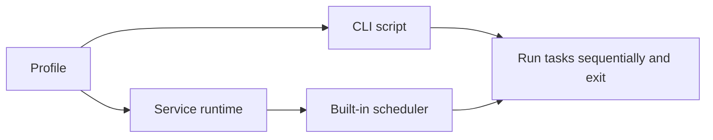

The BAAS backend can be started by the Tauri installer or run directly from the command line for development, server workflows, or macOS/Linux source setups. The old `baas-dev/docs` CLI material is preserved here as advanced usage and development reference.

## Two Runtime Modes

| Mode                 | Behavior                                          | Use Case                                                |
| -------------------- | ------------------------------------------------- | ------------------------------------------------------- |
| One-shot CLI         | Runs tasks listed in a script, then exits         | cron, launchd, temporary batch jobs                     |
| Long-running Service | Starts the backend service and built-in scheduler | Tauri client, unattended service, development debugging |



## One-shot CLI

The legacy backend CLI workflow copies an example script and edits the target profile and task list:

```bash
cp cli.example.py cli.your_account.py
pdm run cli.your_account.py
```

This mode does not stay resident, so it fits system schedulers. On macOS with conda:

```bash
conda run -n baas --live-stream pdm run cli.your_account.py
```

## Service Mode

Service mode starts a resident backend and exposes HTTP/WebSocket interfaces for the Tauri client or other control surfaces.

```bash
python main.service.py --host 0.0.0.0 --port 8190 --log-level info
```

Supported flags:

| Flag          | Purpose            |
| ------------- | ------------------ |
| `--host`      | Listen address     |
| `--port`      | Listen port        |
| `--reload`    | Development reload |
| `--log-level` | Logging level      |

## Relationship with the Tauri Client

The Tauri client primarily uses Service mode. The client owns profile UI, scheduler UI, logs, remote display, and command triggers; the backend service owns auth, config sync, task execution, and emulator control.

Normal users do not need to start `main.service.py` manually. Direct startup is useful when:

- Debugging Tauri-to-backend connection failures.
- Capturing full backend terminal logs.
- Running from source on macOS/Linux.
- Developing WebSocket, auth, remote display, or config-sync features.

## Environment Summary

The legacy docs recommended conda or venv for Python setup. A source backend environment usually starts with:

```bash
conda create -n baas_env python=3.9.21
conda activate baas_env
pip install -r requirements.txt
```

On Linux/macOS, use the backend repository's current requirements file, such as `requirements-linux.txt`, when applicable. Tauri users should prefer the installer-managed environment.
