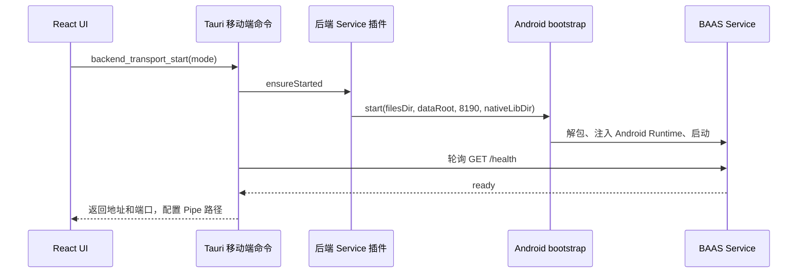

Android 通过 Chaquopy 内嵌 Python 3.9。Kotlin 前台 Service 插件启动 Python bootstrap，由后者把随 APK 分发的 BAAS Service 解包到应用私有存储，并在 `127.0.0.1:8190` 启动。

Android 不注册 `backend_cpp_transport_start`，前端归一化也会拒绝 `cpp` Runtime。这是明确的平台边界，不是先尝试 C++、失败后自动回退。

## 启动流程



就绪等待有明确超时。缺失依赖或 bootstrap 失败必须出现在 `/health`、系统日志或 Android 日志中，不能让 SetupPage 无限等待。

## 传输

Android 同时支持 `pipe` 和 `websocket`，默认使用 `pipe`。

- Pipe 使用 Android 后端 Service 插件返回的 Unix domain socket。
- `BackendPipeManager` 与 TypeScript `TauriPipeConnection` 使用和桌面端相同的 `BPIP` 协议。
- WebSocket 继续使用 loopback HTTP/WebSocket 端点。
- 切换模式时只持久化 `general.transport`，不能覆盖其他 setup 字段。

## 存储与更新

Android setup 状态位于应用管理的存储目录。`updater_start_workflow` 使用 Rust git2 同步旧有 BAAS Python 仓库与 Android Cpp/OCR 预编译仓库，持久化其 revision，并返回终端会话元数据。Kotlin bootstrap 另外负责保留并解包随包分发的 Android Service payload。Android 不依赖桌面 `uv`、系统 Python、桌面可写安装目录或 `pygit2`。

当前版本中，新的双仓库 runtime activation store 尚未接入 Android 命令或前端流程，不能把它描述成 Android 启动流程的一部分。

配置中包含：

```toml
[general]
transport = "pipe"

[python]
runtime_path = "embedded-python-3.9"
```

## Android 本地控制

脚本配置必须保持：

```toml
screenshot_method = "android_local"
control_method = "android_local"
```

UI、Rust 宿主和 Python 兼容层都要维护这两个外部值。可以用 Rust、Kotlin 或 Python 优化内部实现，但不能改变公开方法名。

## 平台差异

| API | Android 行为 |
| --- | --- |
| 全局快捷键 | 已启用绑定会以 unsupported/rejected 返回。 |
| DevTools 命令 | 空操作。 |
| 客户端更新检查 | 读取 Android 安装包元数据。 |
| MirrorC 验证 | 不可用时返回 Android 兼容的 unsupported 报告。 |
| 虚拟显示器 | 支持 `configId`、可选 `adbPath` 等 Android 专用字段。 |
| C++ Runtime 选择 | 不支持；命令未注册，UI/Runtime 归一化保持 Python。 |
