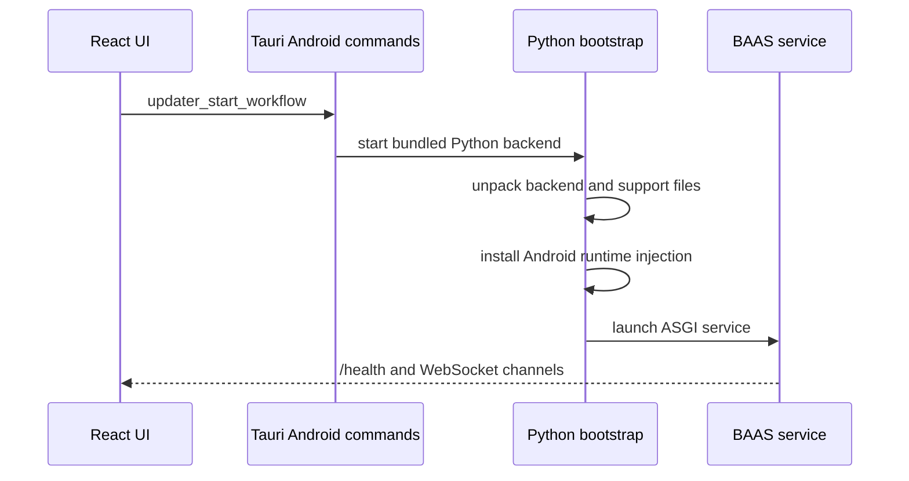

Android 版不运行桌面 uv 后端，也不依赖用户选择 ADB 控制方式。Tauri Android 层通过 Chaquopy 启动捆绑 Python 后端，并把截图、点击、滑动等能力固定到 Android 本地化实现。

## 启动流程



## Android 专用能力

| 能力 | 入口 | 说明 |
| --- | --- | --- |
| 后端 unpack | `android_backend/bootstrap.py` | 把捆绑后端展开到 app storage。 |
| 本地 atx-agent | `_ensure_local_atx_agent` | 在 Android 文件系统中准备本地 agent。 |
| uiautomator2 stub | `_write_uiautomator2_stub` | 提供兼容 API，内部映射到 Android 本地方法。 |
| cv2 兼容层 | `android_backend/cv2_compat.py` | 提供 Android 可运行的图像处理子集。 |
| runtime 注入 | `android_runtime_injection.py` | 同步分辨率、包装 service 注入、固定运行差异。 |

## 控制模式

Android build 的运行配置必须满足：

```toml
screenshot_method = "android_local"
control_method = "android_local"
```

前端、Rust command 和 Python 侧都应把这两个字段视为 Android 固定契约。不要在 Android 上回退到桌面 ADB 截图或桌面 uiautomator 调用，除非新增的是 Android 本地层内部更快实现，并且仍对外暴露为 `android_local`。

## 更快实现的放置位置

如果发现比 uiautomator2 和截图兼容层更快的 Android 本地方案，可以使用 Rust、Python 或 Kotlin 实现，但必须满足：

1. Python 侧业务仍然通过稳定接口调用，不直接依赖 Tauri UI 状态。
2. 通信协议清晰，可以通过 `/health` 或 WebSocket 报告错误。
3. 对前端配置仍然表现为 `android_local`。
4. 失败时能够回到可诊断日志，而不是卡在启动页。

## 更新限制

Android 端不能假设存在桌面 `uv`、系统 Python、可写安装目录或 pygit2。后端更新相关 command 应返回 Android 兼容报告；无法执行的 Git 能力要给出明确错误，而不是让脚本静默卡住。
