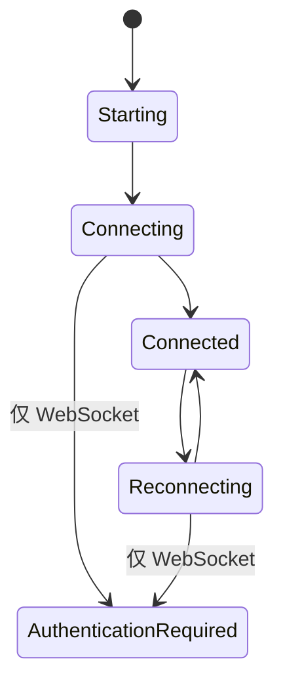

前端通过 `BackendConnection` 与后端业务通道通信。页面和 Store 不应依赖 WebSocket 专用方法，也不应直接调用 Pipe 命令。

## 连接接口

```ts
export type BackendChannelName = "provider" | "sync" | "trigger" | "remote";
export type BackendTransportMode = "websocket" | "pipe";

export interface BackendConnection {
  readonly readyState: number | undefined;
  connect(
    onMessage: (message: unknown) => void,
    decodeJson?: boolean,
    decrypt?: boolean,
  ): Promise<void>;
  sendJson(payload: Record<string, unknown>): Promise<void> | void;
  sendBytes(payload: ArrayBuffer | Uint8Array): Promise<void> | void;
  close(): Promise<void> | void;
}
```

可选的 `onOpen`、`onClose`、`onError` 和 `hookClose` 回调提供生命周期状态，同时不暴露具体传输实现。

## 工厂规则

`src/transport/factory.ts` 负责选择模式：

1. WebUI 始终创建 `SecureWebSocket`。
2. 原生 Tauri 读取 `startup.config.general.transport`。
3. 字段缺失或无效时选择 Pipe。
4. 业务通道连接前，`backend_transport_start` 先准备对应后端。
5. Pipe 创建 `TauriPipeConnection`；WebSocket 需要后端 URL 和已认证会话。

## Store 边界

`src/store/WebsocketStore.ts` 保留了历史名称，但管理的是与传输无关的后端状态。页面应使用 Store，不能自行打开 `/ws/*` 或原生端点。



provider、sync、trigger 和 remote 的消息处理必须共享。只有连接建立、帧封装和 WebSocket 认证属于适配器。

## 配置与 Android

SetupPage 高级设置和主页面设置都写入 `general.transport`。Android 支持两种模式并默认使用 Pipe，但脚本配置仍强制：

| 字段 | Android 值 | UI |
| --- | --- | --- |
| `screenshot_method` | `android_local` | 固定 |
| `control_method` | `android_local` | 固定 |

## 终端契约

`TermViewer` 应立即恢复结构化快照，把增量 chunk 写入 xterm，并在尺寸变化时调用 `updater_resize_term`。不能把终端替换为拼接的纯文本，也不能等到第一个实时 chunk 到达后才显示初始状态。

## 兼容性检查

- 新增文案时更新所有 locale。
- 把与传输无关的消息逻辑放在 Store 或共享模块。
- 模式、后端或组件所有权变化时关闭旧连接。
- Pipe 和 WebSocket 错误都要成为可定位的连接失败。
- Android 不得暴露桌面端专用控制方式。
