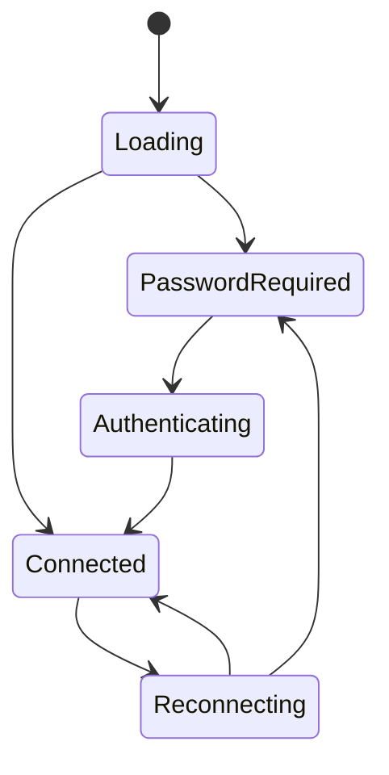

前端运行时负责把 Tauri command、Service WebSocket 和页面组件组合成用户可操作的状态机。它不是简单 UI 层，很多跨端兼容逻辑都在这里收敛。

## 核心模块

| 模块 | API 角色 | 注意事项 |
| --- | --- | --- |
| `src/store/WebsocketStore.ts` | 后端连接、WebSocket resume、版本状态、远程画面入口 | 不要在页面里重复实现连接状态机。 |
| `src/shared/StorageManager.ts` | localStorage 和 Tauri storage 兼容封装 | 桌面端优先 Tauri storage，Web 环境回落 localStorage。 |
| `src/shared/I18nTranslator.ts` | 前端 i18n 加载和后端语言同步 | 新增语言 key 必须同步所有 locale 文件。 |
| `src/features/ScriptConfig.tsx` | 脚本运行配置编辑 | Android 下截图和控制方式固定为 `android_local`。 |
| `src/components/updater/TermViewer.tsx` | 更新器终端视图 | 必须使用 xterm 语义消费 chunk 和 resize。 |

## 连接状态

`WebsocketStore` 是后端连接的单一数据源。页面组件应读取 store 暴露的状态，而不是直接打开 `/ws/*`。

## Android 固定配置

Android 版不能向用户暴露桌面控制方式。配置 UI 应满足：

| 字段 | Android 值 | UI 行为 |
| --- | --- | --- |
| `screenshot_method` | `android_local` | 显示为固定值，不允许选择。 |
| `control_method` | `android_local` | 显示为固定值，不允许选择。 |

组件保存配置时也要防御性处理：即使旧配置或后端快照带了桌面方法，Android build 仍然写回 `android_local`。

## 终端输出

更新日志必须走 `TermViewer` 和 xterm，避免把 chunk 当普通文本直接拼接。正确行为是：

1. Rust command 返回结构化终端快照。
2. 前端用 xterm 写入增量 chunk。
3. resize 时调用 `updater_resize_term`。
4. 首屏恢复时调用 `updater_terminal_snapshot`。

## i18n 规则

新增前端文案时必须同步 `public/locales` 下所有语言文件。暂时无法翻译的文本应保留英文可读值，不要留空字符串，也不要让 key 直接出现在 UI 中。

## 页面开发边界

页面组件只负责呈现和触发动作。涉及连接、认证、远程画面、终端、版本检查、Android 兼容的逻辑应放在 store、shared 或专用组件中，否则很容易出现桌面端可用但 Android 端启动失败的分叉行为。
