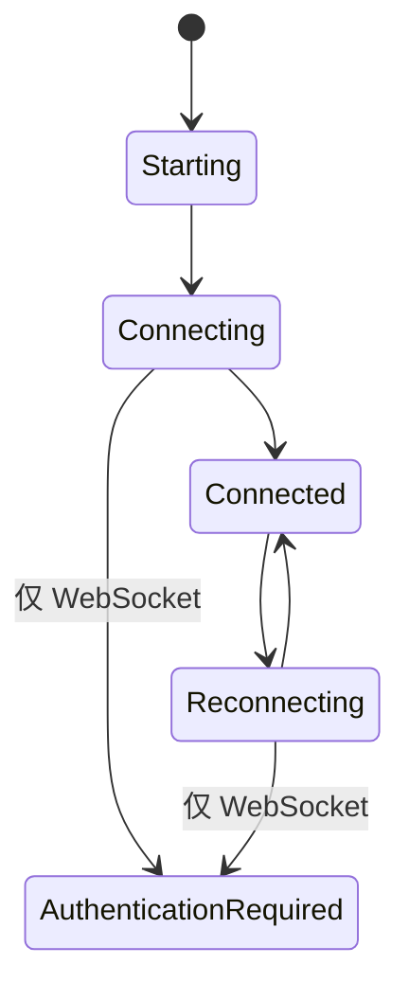

前端通过 `BackendConnection` 与后端业务通道通信。页面和 Store 不应依赖 WebSocket 专用方法，也不应直接调用 Pipe 命令。

## 连接接口

```ts
export type BackendChannelName = "provider" | "sync" | "trigger" | "remote";
export type BackendTransportMode = "websocket" | "pipe";
export type BackendRuntimeKind = "python" | "cpp";

export interface BackendConnection {
  readonly readyState: number | undefined;
  connect(
    onMessage: (message: any) => void,
    decodeJson?: boolean,
    decrypt?: boolean,
  ): Promise<void>;
  sendJson(payload: Record<string, unknown>): Promise<void> | void;
  sendBytes(payload: ArrayBuffer | Uint8Array): Promise<void> | void;
  close(): Promise<void> | void;
}
```

可选的 `onOpen`、`onClose`、`onError` 和 `hookClose` 回调提供生命周期状态，同时不暴露具体传输实现。

## 工厂规则

`src/transport/factory.ts` 负责 Runtime 与模式归一化：

1. WebUI 始终创建 `SecureWebSocket`，没有原生后端启动命令。
2. Android 强制使用 `python` Runtime，并允许 Pipe 或 WebSocket。
3. 桌面 Tauri 从同一份 startup snapshot 读取 Runtime 与 transport，避免混用不同 revision。
4. 桌面值缺失或无效时选择 Python + Pipe；选择 C++ 时强制 WebSocket。
5. Python 调用 `backend_transport_start`；桌面 C++ 调用 `backend_cpp_transport_start`，后者不会回退到 Python。
6. Pipe 创建 `TauriPipeConnection`；WebSocket 需要后端 URL 和已认证会话。

`startCppBackendTransport()` 是显式 C++ 命令的桌面类型化封装，在调用 Rust 前就会拒绝 Pipe。Android 会在调用 Rust 前拒绝 C++，而且 Android 命令注册表中根本没有 C++ 命令。

## Store 边界

`src/store/WebsocketStore.ts` 保留了历史名称，但管理的是与传输无关的后端状态。页面应使用 Store，不能自行打开 `/ws/*` 或原生端点。



provider、sync、trigger 和 remote 的消息处理必须共享。只有连接建立、帧封装和 WebSocket 认证属于适配器。切换选择时，Store 会取消待处理 recovery、关闭全部业务连接、清理原生 Pipe 状态、激活所选后端，在 WebSocket 模式完成认证、重连所需通道，最后恢复初始化。

如果原生活化失败，Rust 会回滚持久化选择，Store 也恢复原 Runtime/模式。如果活化成功但随后认证或通道连接失败，新选择仍是权威状态，Store 会暴露连接错误供重试。

## 配置与 Android

桌面设置提供 Python/C++ Runtime 与 transport 选择；选中 C++ 时禁用 Pipe。Android 支持两种 transport、默认 Pipe，并且绝不显示 C++。其脚本配置仍强制：

| 字段 | Android 值 | UI |
| --- | --- | --- |
| `screenshot_method` | `android_local` | 固定 |
| `control_method` | `android_local` | 固定 |

## 终端契约

`TermViewer` 应立即恢复结构化快照，把增量 chunk 写入 xterm，并在尺寸变化时调用 `updater_resize_term`。不能把终端替换为拼接的纯文本，也不能等到第一个实时 chunk 到达后才显示初始状态。

## 兼容性检查

- 新增文案时更新所有 locale。
- 把与传输无关的消息逻辑放在 Store 或共享模块。
- 模式、后端或组件所有权变化时关闭旧连接。
- 保持 `backend_cpp_transport_start` 仅桌面可用且 fail closed；不能把 C++ 启动失败伪装成 Python 成功。
- Pipe 和 WebSocket 错误都要成为可定位的连接失败。
- Android 不得暴露桌面端专用控制方式。
- 在明确注册命令并完成生命周期测试之前，不为 runtime-repository 下载/活化增加 UI。
