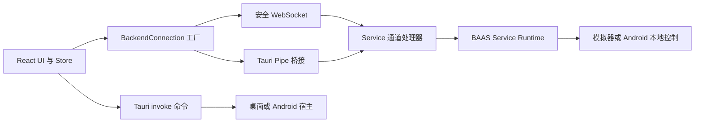

BAAS Tauri 有四类相互关联的边界：React 与 Rust 之间的 Tauri IPC、React 与 Python Service 之间的传输适配器、与传输方式无关的 Service 通道，以及各平台的启动和运行时代码。命令名、请求字段、通道消息和 Pipe 帧都应视为带版本的 API。

## 运行流程



## API 分层

| 层 | 主要入口 | 契约 |
| --- | --- | --- |
| 前端传输 | `src/transport/types.ts`、`src/transport/factory.ts` | `BackendConnection`、通道名、传输选择 |
| Tauri IPC | `src-tauri/src/lib.rs`、`commands.rs`、`mobile_commands.rs` | 已注册命令名、camelCase 参数和序列化结果 |
| Pipe 桥接 | `src-tauri/src/pipe_commands.rs` | 原生端点生命周期和 `BPIP` 帧转发 |
| Service 传输 | `baas-dev` 的 `service/channels`、`service/transport`、`service/api` | provider、sync、trigger、remote 的共享行为 |
| Android 运行时 | Rust 移动端命令、Kotlin Service 插件、Python bootstrap | 应用私有后端、Pipe 路径和 Android 本地控制 |
| 配置与验证 | `setup.toml`、前端测试、CI 工作流 | 默认值、迁移和跨平台兼容 |

## 传输选择

| 运行环境 | 默认值 | 可用模式 |
| --- | --- | --- |
| 桌面 Tauri | Pipe | Pipe 或 WebSocket |
| Android Tauri | Pipe | Pipe 或 WebSocket |
| WebUI | WebSocket | 仅 WebSocket |

原生客户端把选择存入 `general.transport`。字段缺失或无效时回退到 `pipe`；WebUI 不得调用原生 Pipe 命令。

## 稳定性规则

1. 重命名 Tauri 命令时，必须同时迁移桌面端和 Android 端的所有 `invoke()` 调用。
2. provider、sync、trigger、remote 处理器通过 Pipe 和 WebSocket 时必须保持相同行为。
3. JSON 优先增加可选字段；已有消息类型和关联字段必须继续可读。
4. Pipe 帧的 magic、版本、kind、字节序和大小限制都是协议常量。
5. Android 的 `screenshot_method` 和 `control_method` 固定为 `android_local`。
6. 修改两种语言的文档，并执行[契约与测试](/docs/zh/api/contracts-testing)中的验证矩阵。

## 类型化调用示例

```ts twoslash
type BackendTransportMode = "websocket" | "pipe";

type BackendReady = {
  baseBackendAddr: string;
  baseBackendPort: number;
};

declare function invoke<TResult>(
  command: string,
  args?: Record<string, unknown>,
): Promise<TResult>;

const ready = await invoke<BackendReady>("backend_transport_start", {
  mode: "pipe" satisfies BackendTransportMode,
});

ready.baseBackendPort;
```
