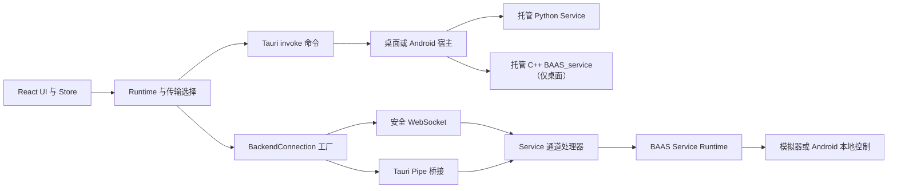

BAAS Tauri 有四类相互关联的边界：React 与 Rust 之间的 Tauri IPC、React 与所选后端 Service 之间的传输适配器、与传输方式无关的业务通道，以及各平台的启动与 Runtime 所有权。命令名、请求字段、通道消息和 Pipe 帧都应视为带版本的 API。

Python Runtime 仍是默认兼容路径。桌面 Tauri 可以显式选择 C++ Runtime，但当前只支持 WebSocket；Android 仍只支持 Python。WebUI 不启动、也不持有后端进程，只连接已经运行且协议兼容的 WebSocket Service。

## 运行流程



## API 分层

| 层 | 主要入口 | 契约 |
| --- | --- | --- |
| 前端传输 | `src/transport/types.ts`、`src/transport/factory.ts` | `BackendConnection`、通道名、传输选择 |
| Tauri IPC | `src-tauri/src/lib.rs`、`commands.rs`、`mobile_commands.rs` | 已注册命令名、camelCase 参数和序列化结果 |
| Pipe 桥接 | `src-tauri/src/pipe_commands.rs` | 原生端点生命周期和 `BPIP` 帧转发 |
| Python Service | `baas-dev` 的 `service/channels`、`service/transport`、`service/api` | Pipe 与 WebSocket 上的默认兼容行为 |
| C++ Service | `baas-cpp-dev` Service Application 与 `backend_cpp_transport_start` | 桌面托管生命周期与 WebSocket 协议对齐 |
| Android 运行时 | Rust 移动端命令、Kotlin Service 插件、Python bootstrap | 应用私有后端、Pipe 路径和 Android 本地控制 |
| 打包与验证 | `scripts/stage-cpp-service.mjs`、前端测试、CI 工作流 | Runtime 资源、生命周期门禁和跨平台兼容 |

## 传输选择

| 环境与 Runtime | 默认值 | 可用模式 |
| --- | --- | --- |
| 桌面 Tauri，Python | Python + Pipe | Pipe 或 WebSocket |
| 桌面 Tauri，C++ | 默认不选中 | 仅 WebSocket |
| Android Tauri | Python + Pipe | Pipe 或 WebSocket |
| WebUI | 外部持有的 Service + WebSocket | 仅 WebSocket；没有原生进程启动命令 |

`resolveBackendSelection()` 是前端选择权威：Android 强制 Python，WebUI 使用 Python 作为不持有进程的 sentinel，桌面 C++ 强制 WebSocket，其余原生客户端缺省回退到 Pipe。WebUI 的 sentinel 不限制外部 Service 的实现语言。`backend_transport_start` 始终激活 Python；`backend_cpp_transport_start` 是显式且仅桌面可用的 C++ 入口。

当前版本中的 Rust runtime-repository activation store 仍是 updater 的内部构建块；尚未注册 runtime-repository git2 downloader、Tauri 活化命令或前端入口。

## 稳定性规则

1. 重命名 Tauri 命令时，必须同时迁移桌面端和 Android 端的所有 `invoke()` 调用。
2. provider、sync、trigger、remote 契约必须在 Python 与 C++ 之间保持兼容，并显式记录传输层尚未覆盖的部分。
3. JSON 优先增加可选字段；已有消息类型和关联字段必须继续可读。
4. Pipe 帧的 magic、版本、kind、字节序和大小限制都是协议常量。
5. Android 的 `screenshot_method` 和 `control_method` 固定为 `android_local`。
6. 原生活化失败时必须停止被拒绝的子进程、关闭陈旧 Pipe 连接并恢复原选择。
7. 修改两种语言的文档，并执行[契约与测试](/docs/zh/api/contracts-testing)中的验证矩阵。

## 类型化调用示例

```ts twoslash
type BackendRuntimeKind = "python" | "cpp";
type BackendTransportMode = "websocket" | "pipe";

type BackendReady = {
  baseBackendAddr: string;
  baseBackendPort: number;
};

declare function invoke<TResult>(
  command: string,
  args?: Record<string, unknown>,
): Promise<TResult>;

const runtime: BackendRuntimeKind = "cpp";
const command =
  runtime === "cpp" ? "backend_cpp_transport_start" : "backend_transport_start";
const ready = await invoke<BackendReady>(command, {
  mode: "websocket" satisfies BackendTransportMode,
});

ready.baseBackendPort;
```
