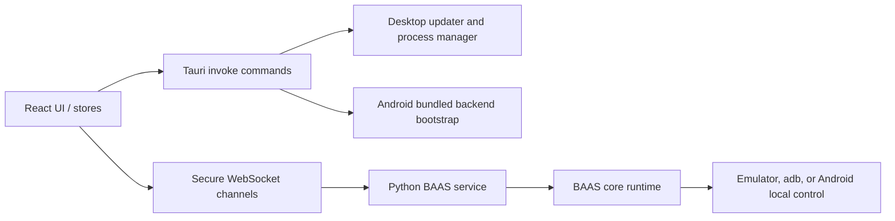

BAAS Tauri 的 API 边界分为五层：React 前端、Tauri command、桌面/Android 启动器、Python 后端服务，以及模拟器或 Android 本机控制层。开发时应先确认改动落在哪一层，再决定是改调用契约、启动行为、配置 schema，还是运行时注入。

## 跨端调用图



## API 分层

| 层级 | 主要入口 | 使用方 | 维护重点 |
| --- | --- | --- | --- |
| 前端运行时 | `src/store/WebsocketStore.ts`、页面组件、配置组件 | React UI | 连接生命周期、状态缓存、i18n、Android 写死配置 |
| Tauri commands | `src-tauri/src/commands.rs`、`mobile_commands.rs`、`behavior.rs` | 前端 `invoke()` | 参数和返回值稳定、错误可展示、Android/桌面差异明确 |
| 后端 Service | `service.api.*`、`service.injection.*` | Tauri 客户端和远程 Web UI | WebSocket resume、鉴权、配置同步、隔离注入 |
| Android runtime | `src-tauri/gen/android/.../android_backend` | Android 版 Tauri 和 Python 侧 | 本地化控制、Chaquopy 启动、兼容层、无桌面路径假设 |
| 配置和验证 | `setup.toml`、app storage、测试脚本 | 所有端 | schema 兼容、脚本可跑通、失败信息可定位 |

## 稳定性规则

1. Tauri command 名称是前端 API，改名必须同步迁移所有 `invoke()` 调用。
2. WebSocket frame 的 `type`、`request_id`、`channel`、`payload` 字段是后端 API，新增字段应保持向后兼容。
3. Android 版的截图方式和控制方式必须锁定为 `android_local`，前端不能让用户切换到桌面方法。
4. Service 模式只允许通过 `service` 文件夹内部的注入点扩展主仓库行为，不能要求主代码 `main` 或 `core` 为 service 模式写分支。
5. API 变更必须同时验证桌面、Android 和 Python 侧脚本，文档页 [契约与测试](/docs/zh/api/contracts-testing) 给出最低矩阵。

## Twoslash 示例

下面的 TypeScript 片段使用文档站的 Twoslash 高亮。悬停类型可用于解释前端 `invoke()` contract。

```ts twoslash
type TauriCommand<TArgs, TResult> = {
  command: string;
  args: TArgs;
  result: TResult;
};

type TerminalSnapshotRequest = {
  sessionId?: string;
};

type TerminalSnapshot = {
  sessionId: string | null;
  rows: number;
  cols: number;
  regions: Array<{ id: string; lines: string[] }>;
};

const terminalSnapshot: TauriCommand<
  { request: TerminalSnapshotRequest },
  TerminalSnapshot
> = {
  command: "updater_terminal_snapshot",
  args: { request: { sessionId: "active" } },
  result: { sessionId: "active", rows: 24, cols: 80, regions: [] },
};

terminalSnapshot.result.regions[0]?.lines;
```

## 开发建议

跨端 API 改动优先写文档，再改代码。这样可以先固定参数、返回值、失败模式和测试矩阵，避免桌面端和 Android 端各自实现一套互不兼容的行为。
