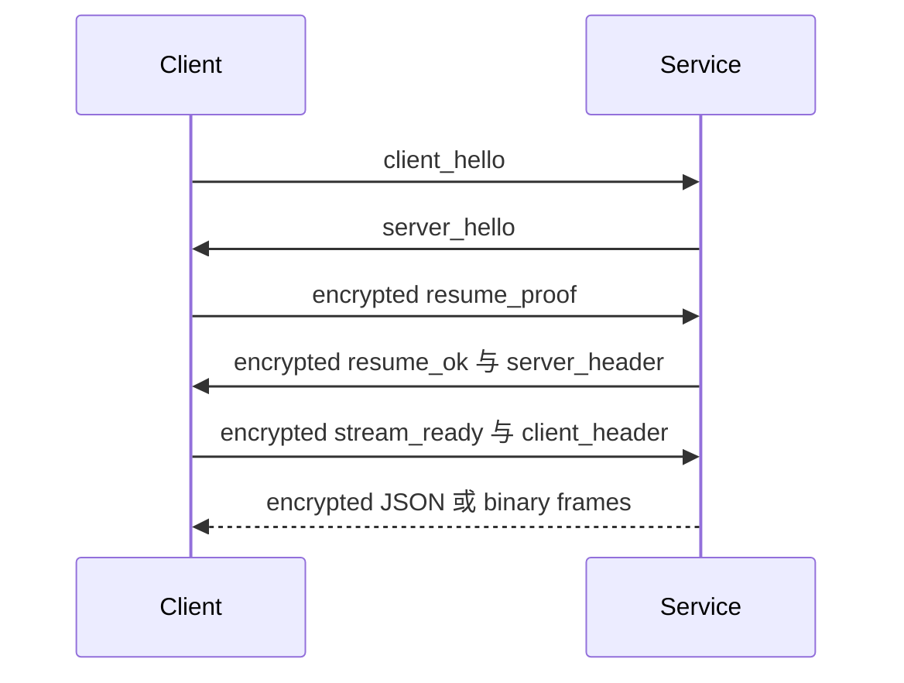

Python Service 通过两种适配器暴露相同的 provider、sync、trigger 和 remote 处理器。业务逻辑依赖 `ChannelEndpoint` 协议，不依赖 FastAPI WebSocket 或具体操作系统 Pipe 对象。

## 端点

| 传输 | 入口 | 可用范围 |
| --- | --- | --- |
| HTTP | `GET /health`、`POST /auth/remember`、`POST /auth/logout` | 所有模式；health 同时用于就绪检查。 |
| WebSocket control | `/ws/control` | WebSocket 认证、resume、心跳和密码管理。 |
| WebSocket 业务通道 | `/ws/provider`、`/ws/sync`、`/ws/trigger`、`/ws/remote` | WebUI 和原生 WebSocket 模式。 |
| 原生 Pipe | Windows named pipe 或 Unix domain socket | 桌面端和 Android 的原生 Pipe 模式。 |

## 共享业务通道

| 通道 | 处理器职责 |
| --- | --- |
| `provider` | 日志、运行状态、静态请求和状态请求。 |
| `sync` | 配置快照、patch、文件系统事件和持久化状态。 |
| `trigger` | 命令及带关联 ID 的 `command_response`。 |
| `remote` | 远程画面的二进制与控制流量。 |

只修改某个传输适配器而不修改共享通道处理器，会破坏传输一致性。

## WebSocket 会话

WebSocket 业务通道通过 `/ws/control` 认证，然后恢复加密会话。重连时先尝试 resume，失败后才重新要求密码流程。



## Pipe 协议

每个原生业务连接的第一帧必须是：

```json
{"type":"open","channel":"provider"}
```

Service 返回 `{"type":"open_ok","channel":"provider"}` 后才进入正常通信。

10 字节小端序头部对应 `struct <4sBBI`：

| 偏移 | 大小 | 值 |
| --- | --- | --- |
| 0 | 4 | Magic `BPIP` |
| 4 | 1 | 版本 `1` |
| 5 | 1 | Kind：JSON `1`、bytes `2`、close `3`、error `4` |
| 6 | 4 | 无符号小端序 payload 长度 |

payload 上限为 64 MiB。Windows 使用 named pipe；包括 Android 在内的 Unix 平台使用 Unix domain socket，socket 权限仅允许所有者访问。

## 失败契约

| 失败 | 预期处理 |
| --- | --- |
| magic、版本、kind 无效或 payload 超限 | 以协议错误关闭连接。 |
| 未知通道或第一帧无效 | 发送 error 帧并关闭。 |
| WebSocket 认证或 resume 失败 | 通过 control 流程清理或更新会话。 |
| Sync patch 冲突 | 返回或重新加载权威快照，不能静默关闭 sync。 |
| Remote 不可用 | 返回可读原因并拒绝通道或操作。 |
| 后端启动失败 | 通过 `/health` 和宿主日志暴露就绪或依赖错误。 |
