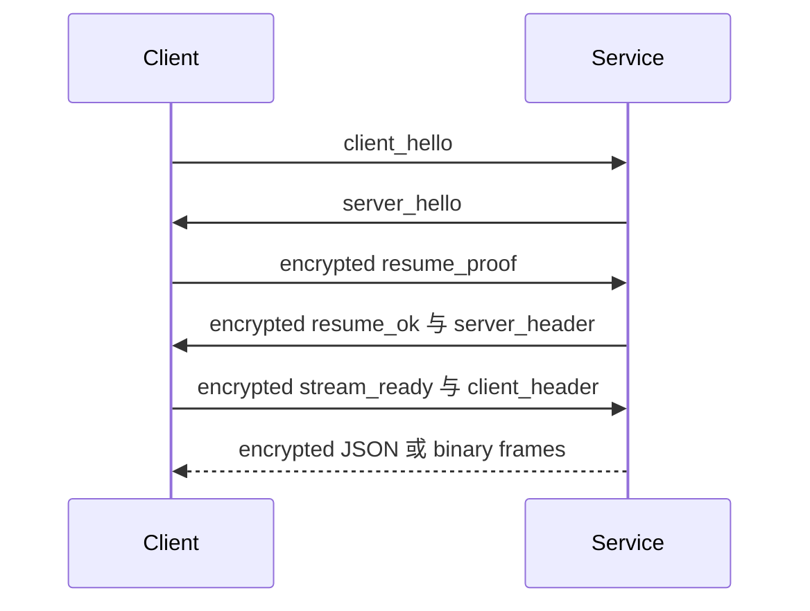

Python Service 通过与传输无关的 `ChannelEndpoint` 适配器暴露 provider、sync、trigger 和 remote。C++ Service 在 `baas-cpp-dev` 中实现相同的公开 WebSocket 路由与 BPIP 分帧。就 Tauri 接入而言，Python 支持两种适配器，C++ 启动入口当前只启用 WebSocket。

## 端点

| 传输 | 入口 | 可用范围 |
| --- | --- | --- |
| HTTP identity/lifecycle | `GET /version`、`GET /health`、`POST /shutdown` | C++ 托管 Service 的身份、就绪与优雅关闭；Python 也提供 health。 |
| HTTP 认证 | `POST /auth/remember`、`POST /auth/logout` | WebSocket session 支持。 |
| WebSocket control | `/ws/control` | 认证、resume、心跳和密码管理。 |
| WebSocket 业务通道 | `/ws/provider`、`/ws/sync`、`/ws/trigger`、`/ws/remote` | Python、C++、WebUI 与原生 WebSocket 模式。 |
| 原生 Pipe | Windows named pipe 或 Unix domain socket | Python 桌面与 Android 接入；C++ Service 已有 BPIP 支持，但 Tauri 尚未选择它。 |

## 共享业务通道

| 通道 | 处理器职责 |
| --- | --- |
| `provider` | 日志、运行状态、静态请求和状态请求。 |
| `sync` | 配置快照、patch、文件系统事件和持久化状态。 |
| `trigger` | 命令及带关联 ID 的 `command_response`。 |
| `remote` | 远程画面的二进制与控制流量。 |

只在某个 Python 传输适配器中增加行为会破坏传输一致性。C++ 只有在外部消息形状、关联值、二进制顺序和错误行为通过同一套契约测试后才算兼容；仅复用路由名不够。

## WebSocket 会话

WebSocket 业务通道通过 `/ws/control` 认证，然后恢复加密会话。重连时先尝试 resume，失败后才重新要求密码流程。



## Pipe 协议

每个原生业务连接的第一帧必须是：

```json
{"type":"open","channel":"provider"}
```

Service 返回 `{"type":"open_ok","channel":"provider"}` 后才进入正常通信。

10 字节小端序头部对应 `struct <4sBBI`：

| 偏移 | 大小 | 值 |
| --- | --- | --- |
| 0 | 4 | Magic `BPIP` |
| 4 | 1 | 版本 `1` |
| 5 | 1 | Kind：JSON `1`、bytes `2`、close `3`、error `4` |
| 6 | 4 | 无符号小端序 payload 长度 |

payload 上限为 64 MiB。Windows 使用 named pipe；包括 Android 在内的 Unix 平台使用 Unix domain socket，socket 权限仅允许所有者访问。Tauri 还对 open handshake 设置超时，通过 `clientAttempt` 取消，并要求每个 send/close 携带不透明 ownership token。

## Runtime 与进程生命周期

| Runtime | 宿主命令 | 就绪条件 | 关闭所有权 |
| --- | --- | --- | --- |
| Python 桌面 | `backend_transport_start` | 认证端点可用 | 托管 PID 记录与 Python stop 路径 |
| C++ 桌面 | `backend_cpp_transport_start` | 精确 v1 `/version` 身份与 ready `/health` | 托管 PID identity；可用时先 `/shutdown`，再执行有界清理 |
| Python Android | `backend_transport_start` | Kotlin/Chaquopy Service 与有界 `/health` 轮询 | Android 前台 Service owner |
| WebUI | 无 | 浏览器连接外部 WebSocket endpoint | 外部 owner |

打包的 C++ 可执行文件必须精确命名为 `BAAS_service`（Windows 为 `BAAS_service.exe`），通过 `--version`，并以所选 project root 在 loopback 上运行。独立持有的 remote jar 会被暂存为 `ws-scrcpy-server.jar`。桌面构建还会打包原生 runtime repository updater，并且只向前端暴露不透明签名计划的交接入口；仓库 URL、ref、commit、密钥、路径和 generation 都不是前端可控参数。

## 失败契约

| 失败 | 预期处理 |
| --- | --- |
| magic、版本、kind 无效或 payload 超限 | 以协议错误关闭连接。 |
| 未知通道或第一帧无效 | 发送 error 帧并关闭。 |
| WebSocket 认证或 resume 失败 | 通过 control 流程清理或更新会话。 |
| Sync patch 冲突 | 返回或重新加载权威快照，不能静默关闭 sync。 |
| Remote 不可用 | 返回可读原因并拒绝通道或操作。 |
| 后端启动失败 | 通过 `/health` 和宿主日志暴露就绪或依赖错误。 |
| 原生活化失败 | 停止被拒绝的子进程、关闭陈旧传输状态并恢复原选择；绝不从 C++ 静默回退到 Python。 |
