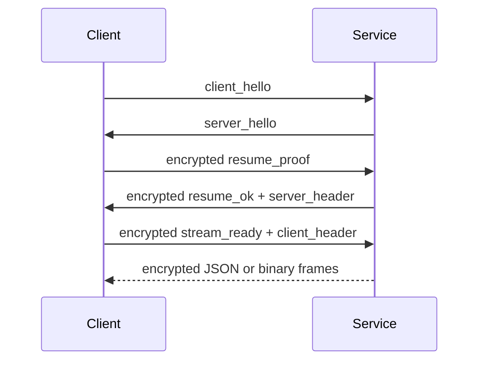

Service 模式提供 Tauri 客户端和 Web UI 共用的后端 API。更详细的模块说明见 [后端服务接口](/docs/zh/reference/backend-service)，本页只记录开发者需要依赖的稳定调用契约。

## HTTP 入口

| Endpoint | 方法 | 认证 | 用途 |
| --- | --- | --- | --- |
| `/health` | `GET` | 无 | 返回服务存活状态、认证状态和 Android 兼容错误。 |
| `/auth/remember` | `POST` | remember proof | 交换 remember cookie。 |
| `/auth/logout` | `POST` | cookie | 注销 remember cookie。 |

`/health` 必须足够轻量，前端启动页会反复轮询它。Android 版缺少 Python 依赖或兼容层失败时，也应通过 `/health` 报告第一处可读错误。

## WebSocket 入口

| Endpoint | 通道 | 内容 | 是否加密 |
| --- | --- | --- | --- |
| `/ws/control` | control | 握手、认证、resume、心跳、密码修改 | 握手后加密 |
| `/ws/sync` | sync | 配置快照、JSON patch、文件系统事件 | resume 后加密 |
| `/ws/provider` | provider | 日志、运行状态、静态状态请求 | resume 后加密 |
| `/ws/trigger` | trigger | 前端命令和 `command_response` | resume 后加密 |
| `/ws/remote` | remote | scrcpy 远程画面代理 | 按会话能力决定 |

## Resume 流程

业务通道不得跳过控制通道认证。前端重新连接时应优先 resume，失败后再回到完整认证流程。

## JSON frame 约定

| 字段 | 类型 | 说明 |
| --- | --- | --- |
| `type` | `string` | frame 类型，例如 `config_snapshot`、`command_response`、`log_chunk`。 |
| `request_id` | `string?` | 请求-响应关联 ID。需要响应的命令必须带上。 |
| `channel` | `string?` | 业务通道名。用于日志和诊断。 |
| `payload` | `object?` | 业务数据。新增字段应向后兼容。 |
| `error` | `object?` | 结构化错误。至少包含 `message`。 |

## 失败模式

| 场景 | 后端行为 | 前端行为 |
| --- | --- | --- |
| cookie 失效 | control 返回认证失败 | 清理会话并弹出密码输入 |
| resume token 失效 | 关闭业务通道或返回 resume 失败 | 重新走 control 认证 |
| 配置 patch 冲突 | 返回当前快照或错误说明 | 重载配置，不做本地盲写 |
| Android 兼容依赖缺失 | `/health` 暴露缺失依赖 | 启动页显示可读日志 |
| remote 不可用 | `/ws/remote` 拒绝或关闭 | 禁用远程画面按钮 |

## Service 隔离注入

Service 模式扩展主仓库行为时，注入点必须保留在 `service` 文件夹内部，例如 `service.injection.apply_service_injections`。不要要求 `core`、`module`、`main` 为 service 模式新增分支；Android runtime 需要包装注入时，也应包装 service 注入函数，而不是直接修改主代码路径。
