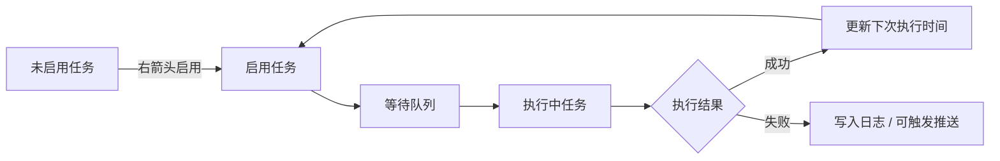

调度页决定当前配置档会执行哪些自动化任务，以及这些任务下一次什么时候执行。配置页负责“任务怎么做”，调度页负责“任务是否做、何时做、前后关系如何”。

## 页面结构

调度页从上到下分为：

- 任务概览：显示正在执行的任务和等待队列。
- 搜索框：按任务名称过滤任务。
- 排序选择：在默认排序和按时间排序之间切换。
- 刷新按钮：把所有任务的下次执行时间刷新为当前时间。
- 未启用任务：暂时不会被调度器执行。
- 启用任务：会进入当前配置档的调度队列。

## 启用与禁用

每个任务行两侧都有箭头按钮。把任务从左侧移动到右侧表示启用，把任务从右侧移动回左侧表示禁用。列标题旁边的箭头可以批量移动全部任务。

建议只启用自己已经配置过并且在当前账号状态下可用的任务。比如咖啡厅、邮箱、领取奖励通常风险较低；商店、扫荡、竞技场、活动和战斗类任务会消耗资源或挑战次数，应该先单独验证。

## 修改下次执行时间

任务行中间的时间控件表示下次执行时间。修改后会写回当前配置档的调度配置。点击刷新按钮会把所有任务的下次执行时间重置为当前时间，适合想立即重新排队时使用。

注意事项：

- 下次执行时间不是“每天固定执行时间”的唯一来源，任务详细调度里还可以配置间隔、每日重置、禁用时间段和前后置任务。
- 如果任务刚执行完又被刷新到当前时间，可能会很快再次进入队列。
- 多个高消耗任务同时刷新时，可能连续消耗体力、券或挑战次数。

## 任务详细调度配置

点击任务行的齿轮按钮会打开任务详细调度配置。这里可以调整优先级、间隔、每日重置时间、禁用时间段、前置任务和后置任务。

| 配置项       | 作用                               | 常见用途                     |
| ------------ | ---------------------------------- | ---------------------------- |
| 优先级       | 默认排序时使用，数字越小通常越靠前 | 让低风险日常先执行           |
| 间隔         | 任务完成后再次可执行的间隔秒数     | 防止任务频繁重复执行         |
| 每日重置时间 | 按日重置任务状态                   | 每天只跑一次的任务           |
| 禁用时间段   | 指定时间内不触发任务               | 避开维护、睡眠或手动游戏时段 |
| 前置任务     | 当前任务执行前必须先完成           | 先领体力再扫荡               |
| 后置任务     | 当前任务完成后衔接执行             | 扫荡后收集奖励或推送         |

## 任务清单

当前调度系统会出现的任务包括：

- 基础日常：咖啡厅、1 号咖啡厅邀请、2 号咖啡厅邀请、日程、商店购买、查收邮箱、收集奖励、收集小组体力、领取 pass 奖励。
- 体力与扫荡：普通关清体力、困难关清体力、悬赏通缉、学院交流会、每日特别委托、活动扫荡。
- 推图与剧情：普通关卡、困难关卡、主线剧情、迷你剧情、社团剧情、活动剧情、活动任务、活动挑战。
- 战斗活动：竞技场、竞技场商店购买、总力战、综合战术测试、日常小游戏。
- 维护类：自动 MomoTalk、清理好友、自动制造、收集免费购买体力、收集每日体力、凌晨四点重启、反和谐。

## 推荐启用顺序

首次配置推荐按这个顺序逐步启用：

1. 咖啡厅、邮箱、收集奖励。
2. 日程、商店购买、社团体力。
3. 普通/困难扫荡、悬赏通缉、学院交流会、每日特别委托。
4. 制造、MomoTalk、好友清理。
5. 竞技场、总力战、战术测试、活动和推图。

每一步都先运行一次并查看日志，确认识别到的页面、关卡、次数、购买项目和点击行为正确。

<Callout type="idea" title="调度不是越满越好">
  把所有任务一次性启用会让排查变难。更稳妥的做法是每次新增 2-3 个任务，跑通后再继续扩展。
</Callout>
