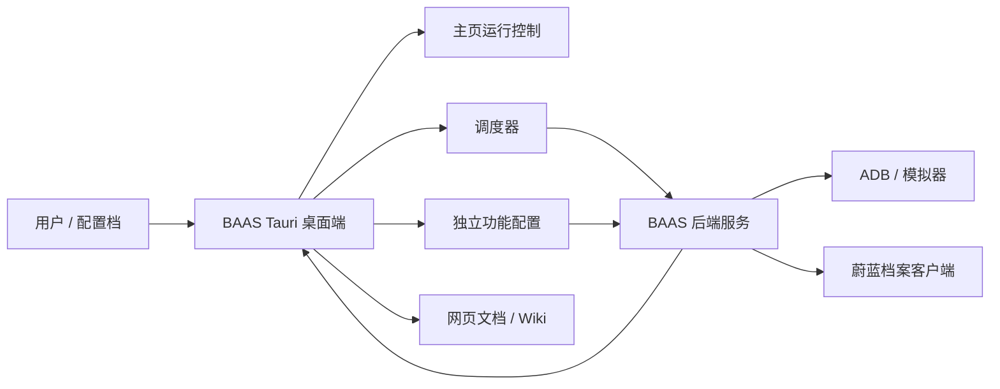

  <section className="baas-doc-intro">
    

      
      Blue Archive Auto Script
    

    <h2>快速开始</h2>
    

      BAAS Tauri 是 BAAS 的桌面工作台：桌面端负责编排配置档、调度、日志、远程画面、更新和文档入口；
      后端负责 ADB 连接、截图识别、脚本执行和状态同步。
    

    

      <a href="./guide/install">开始安装</a>
      <a href="./guide/interface">认识界面</a>
      <a href="./guide/scheduler">配置调度</a>
      <a href="#download">下载客户端</a>
    

  </section>

<Cards className="baas-doc-focus-cards">
  <Card
    icon={<DocHomeIcon name="install" />}
    title="第一次使用"
    href="./guide/install"
    description="下载客户端、启动后端、初始化密钥，并完成第一次连接验证。"
  />
  <Card
    icon={<DocHomeIcon name="interface" />}
    title="理解桌面端"
    href="./guide/interface"
    description="看懂主页、侧边栏、配置档、日志、远程画面和上下文菜单。"
  />
  <Card
    icon={<DocHomeIcon name="scheduler" />}
    title="开始自动化"
    href="./guide/scheduler"
    description="设置任务启用状态、下次运行时间、前置任务和低风险验证顺序。"
  />
  <Card
    icon={<DocHomeIcon name="settings" />}
    title="功能配置"
    href="./features/server"
    description="服务器、模拟器、脚本、推图、扫荡、咖啡厅、商店、制造和战斗都独立维护。"
  />
</Cards>

  <Callout type="info" title="先看这里">
    BAAS 的核心分工是“桌面端负责编排，后端负责任务执行”。排查问题时，优先看配置档、调度状态、ADB
    连接、截图识别和日志。
  </Callout>

<ReleaseDownloadPanel locale="zh" />

  
⚠️ macOS 用户需要手动放行

  

    

      当前 macOS 安装包不会进行 Apple
      公证。首次打开时，如果系统提示无法验证开发者、应用已损坏或要求移到废纸篓，请先确认安装包来自官方
      GitHub Releases，再按 <a href="./guide/install#下载客户端安装包">安装与连接</a> 中的 macOS
      说明处理。
    

  

## 界面预览

<figure className="baas-doc-hero-shot baas-doc-hero-shot-compact">
  
  <figcaption>BAAS Tauri 主页：左侧导航、顶部配置档与区服、任务状态、日志和运行控制。</figcaption>
</figure>

  

    <strong>🧭 主入口</strong>主页、调度、配置、设置、文档五个主页面。
  

  

    <strong>🧩 配置档</strong>按账号、区服、模拟器实例隔离参数。
  

  

    <strong>🧪 验证策略</strong>先跑低风险任务，再加入资源消耗任务。
  

  

    <strong>📚 文档语言</strong>只维护中文和英文，其他语言回退英文。
  

## 阅读路径

| 场景         | 优先阅读                                | 你应该确认                             |
| ------------ | --------------------------------------- | -------------------------------------- |
| 第一次安装   | [安装与连接](./guide/install)           | 后端已启动、密钥正确、服务已连接       |
| 刚进入主界面 | [界面总览](./guide/interface)           | 配置档、日志、远程画面、侧边栏入口     |
| 准备自动运行 | [调度](./guide/scheduler)               | 任务启用状态、下次执行时间、前后置任务 |
| 配置功能     | 下方独立功能页                          | 每个任务会消耗什么、如何验证           |
| 出现异常     | [故障排查](./reference/troubleshooting) | 日志、截图、配置、区服和模拟器信息     |

## 功能配置

  <a href="./features/profile">
    <strong>
      <DocHomeIcon name="profile" />
      配置档
    </strong>
    创建、复制、导入、导出和删除配置档。
  </a>
  <a href="./features/home-runtime">
    <strong>
      <DocHomeIcon name="runtime" />
      主页与运行状态
    </strong>
    启动停止、当前任务、队列、日志、资产和远程画面。
  </a>
  <a href="./features/server">
    <strong>
      <DocHomeIcon name="server" />
      服务器
    </strong>
    国服、国际服、日服等区服规则和任务差异。
  </a>
  <a href="./features/emulator">
    <strong>
      <DocHomeIcon name="emulator" />
      模拟器
    </strong>
    模拟器路径、启动等待、多开和 ADB 连接。
  </a>
  <a href="./features/script">
    <strong>
      <DocHomeIcon name="script" />
      脚本
    </strong>
    启动参数、截图方式、控制方式和后端执行参数。
  </a>
  <a href="./features/pc-platform">
    <strong>
      <DocHomeIcon name="pc" />
      PC 客户端
    </strong>
    Steam 国际服、日服 PC 端、HDR、窗口比例和桌面控制。
  </a>
  <a href="./features/stages">
    <strong>
      <DocHomeIcon name="stages" />
      推图
    </strong>
    普通、困难、剧情和活动关卡。
  </a>
  <a href="./features/sweeps">
    <strong>
      <DocHomeIcon name="sweeps" />
      扫荡
    </strong>
    普通图、困难图、悬赏、学院交流会和活动扫荡。
  </a>
  <a href="./features/team">
    <strong>
      <DocHomeIcon name="team" />
      编队
    </strong>
    侧栏顺序、预设编队和属性编队。
  </a>
  <a href="./features/cafe">
    <strong>
      <DocHomeIcon name="cafe" />
      咖啡厅
    </strong>
    邀请学生、领取收益、互动和舒适度相关操作。
  </a>
  <a href="./features/lesson">
    <strong>
      <DocHomeIcon name="lesson" />
      日程
    </strong>
    区域、票券、优先级和扫荡策略。
  </a>
  <a href="./features/shop">
    <strong>
      <DocHomeIcon name="shop" />
      商店
    </strong>
    普通、竞技场、总力战、熟练证书等商店购买。
  </a>
  <a href="./features/crafting">
    <strong>
      <DocHomeIcon name="crafting" />
      制造
    </strong>
    节点选择、材料投入和领取结果。
  </a>
  <a href="./features/combat">
    <strong>
      <DocHomeIcon name="combat" />
      战斗
    </strong>
    竞技场、总力战、战术测试和高风险战斗任务。
  </a>
  <a href="./features/maintenance">
    <strong>
      <DocHomeIcon name="maintenance" />
      维护
    </strong>
    好友、通知、启动游戏、领取奖励和辅助任务。
  </a>
  <a href="./features/system">
    <strong>
      <DocHomeIcon name="system" />
      系统设置
    </strong>
    主题、语言、缩放、背景图、远程画面和快捷键。
  </a>
  <a href="./features/update">
    <strong>
      <DocHomeIcon name="update" />
      更新
    </strong>
    后端更新、客户端更新、更新源、通道和 SHA 测试。
  </a>
  <a href="./reference/setup-toml">
    <strong>
      <DocHomeIcon name="settings" />
      安装配置
    </strong>
    setup.toml、MirrorC CDK、更新源和后端安装参数。
  </a>
  <a href="./reference/backend-service">
    <strong>
      <DocHomeIcon name="backend" />
      后端服务
    </strong>
    HTTP、WebSocket、认证、配置同步和远程画面接口。
  </a>
  <a href="./reference/auto-fight-dev">
    <strong>
      <DocHomeIcon name="autoFight" />
      自动战斗开发
    </strong>
    轴文件、状态机、模板匹配、OCR 和识别资源维护。
  </a>

## 维护原则

旧的本地 Wiki 不再作为主要维护入口。当前文档主源位于 `baas-tauri/docs`，使用 Fumadocs 生成网页文档站；Tauri 文档页默认加载这个网页文档站，并可在 Tauri 中弹出独立“百科文档”窗口。

## 运行关系

