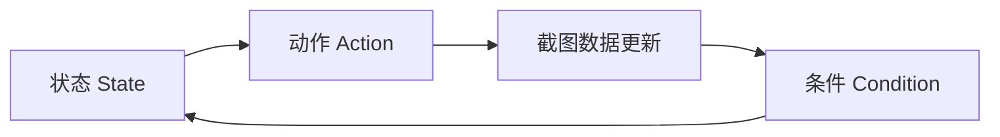

这个页面迁移自旧 `develop_doc/script/auto_fight.md`、`game_feature.md`、`screenshot.md` 和 `ocr.md`，用于理解 BAAS 后端如何从画面中提取状态并执行战斗流程。

<Callout type="warn" title="这是开发参考">
  普通用户只需要在 Tauri 客户端配置任务。这里讨论的是后端自动战斗轴、识别资源和源码维护。
</Callout>

## 自动战斗模型

BAAS 的自动战斗不是使用游戏内 Auto 盲放技能，而是：

1. 持续截图。
2. 从图像中提取费用、技能、血量、时间、角色位置等数据。
3. 按用户定义的“轴”判断条件。
4. 在合适状态释放技能或执行重开、结束等动作。

旧文档把它类比为有限状态自动机：

轴文件是 JSON，核心由三类对象组成：

| 对象 | 作用 |
| ---- | ---- |
| `state` | 当前处于哪个流程节点，到达状态时执行动作，再按条件转移 |
| `action` | 释放技能、重开、等待、切换 Auto 等具体操作 |
| `condition` | 血量、费用、技能名、超时、组合条件等判断 |

## 可监测的战斗数据

自动战斗从截图中维护一组可被条件和动作读取的数据：

| 数据 | 用途 |
| ---- | ---- |
| BOSS 当前血量 / 最大血量 | 血量轴、斩杀判断、重开判断 |
| 技能槽学生名 | 判断指定学生技能是否出现 |
| 技能费用 | 判断是否能释放技能 |
| 当前费用 | 控制释放时机 |
| 倍速 / Auto 状态 | 确认战斗状态 |
| 战斗剩余时间 | 超时或阶段判断 |
| 房间剩余时间 | 总力战等限时场景 |
| 学生和敌人位置 | 目标选择、范围技能和 YOLO 检测 |

## 截图和控制性能

旧文档给出的截图方式经验值：

| 截图方式 | 特点 |
| -------- | ---- |
| `nemu` | MuMu 12 场景速度快、无损，推荐优先测试 |
| `scrcpy` | 速度较快，但不是无损截图 |
| `adb` | 稳定但较慢 |
| `uiautomator2` | 稳定但较慢 |
| `mss` / `pyautogui` | PC 客户端窗口截图场景 |

不同设备和模拟器差异很大。自动战斗、远程画面和普通日常任务对截图延迟的敏感度不同，不要把某个任务的最优配置直接套到所有场景。

## 模板匹配

模板匹配适合识别静态图像：按钮、图标、固定 UI 元素、商店入口等。优点是 CPU 上即可毫秒级执行；缺点是对缩放、旋转、色彩和截图比例敏感。

常见函数职责：

| 函数 | 作用 |
| ---- | ---- |
| `compare_image` | 对固定区域和模板做匹配，返回相似度 |
| `search_in_area` | 在指定区域搜索模板，返回最佳位置和匹配度 |
| `search_image_in_area` | 使用运行时提供的模板图像做区域搜索 |
| `get_image_all_appear_position` | 返回所有超过阈值的出现位置 |
| `swipe_search_target_str` | 滑动搜索目标字符串或图像 |

## OCR

OCR 用于识别文字、数字、血量、费用、活动名或其他无法只靠固定模板稳定判断的信息。旧 OCR 服务支持：

- 多语言模型。
- 单行 OCR。
- 普通 OCR。
- 图像文字框检测。
- 本地图像、远程图像或共享内存传递。

OCR 的代价高于模板匹配。能用稳定模板解决的静态 UI，不应优先使用 OCR；需要读文字、数字或动态内容时再使用 OCR。

## 维护识别资源

新增或更新识别资源时，至少确认：

| 项目 | 要求 |
| ---- | ---- |
| 分辨率 | 优先采集 16:9 标准画面，推荐 1280x720 |
| 格式 | 使用无损 PNG |
| 语言和服务器 | 与目标服务器资源目录一致 |
| 遮挡 | 不要包含鼠标、弹窗、通知遮挡 |
| 命名 | 用语义化名称，不用临时截图名 |
| 验证 | 至少在目标服务器和一个干净配置档中测试 |

如果一个识别失败只发生在 PC 客户端，优先检查 HDR、窗口比例、截图方式和控制方式，而不是直接重采模板。
