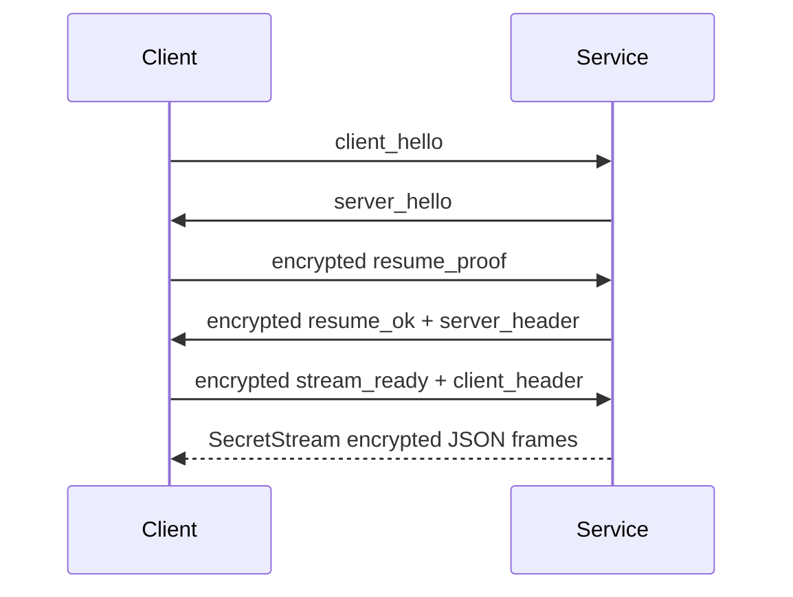

这个页面迁移自 `baas-dev/docs/develop_doc/service_mode.md`，面向维护 Tauri 客户端与 BAAS 后端通信的开发者。

## 入口

后端 Service 模式的稳定入口是：

```bash
python main.service.py --host 0.0.0.0 --port 8190 --log-level info
```

ASGI 入口是 `service.app:app`。它负责组装 FastAPI、CORS、生命周期和路由模块；长期依赖保存在 `service.api.state.context`。

## 模块职责

| 模块                         | 职责                                                           |
| ---------------------------- | -------------------------------------------------------------- |
| `service/api/http.py`        | remember/logout 和 health                                      |
| `service/api/ws_control.py`  | 控制通道认证、心跳、密码修改、认证撤销                         |
| `service/api/ws_sync.py`     | 配置、事件、GUI/setup 快照、JSON patch、配置列表、文件系统推送 |
| `service/api/ws_provider.py` | 日志、状态、静态请求和状态请求                                 |
| `service/api/ws_trigger.py`  | 命令响应 WebSocket                                             |
| `service/api/commands.py`    | 把 trigger 消息分发到 `ServiceRuntime`                         |
| `service/api/ws_remote.py`   | scrcpy 远程画面 WebSocket 代理                                 |
| `service/api/security.py`    | Origin 策略、加密 JSON 帧、控制认证、业务通道 resume           |
| `service/auth/`              | 密码、会话、remember token、签名密钥和 secretstream 传输       |
| `service/conf/`              | 安全配置路径、配置初始化、资源路径、快照、patch 和文件监听     |
| `service/update/`            | `setup.toml`、远程 SHA、CDK 校验和更新执行                     |
| `service/remote/`            | scrcpy 客户端、server jar、代理回调和清理                      |

## 公共接口

HTTP：

| Endpoint              | 作用                                               |
| --------------------- | -------------------------------------------------- |
| `POST /auth/remember` | 校验 remember-session proof 并设置 `baas_remember` |
| `POST /auth/logout`   | 删除 `baas_remember`                               |
| `GET /health`         | 返回服务状态和认证公开状态                         |

WebSocket：

| Endpoint       | 作用                                                       |
| -------------- | ---------------------------------------------------------- |
| `/ws/control`  | `client_hello`、`server_hello`、初始化、认证、resume、心跳 |
| `/ws/sync`     | 配置快照、patch、配置列表和文件系统推送                    |
| `/ws/provider` | 初始日志、运行状态、静态状态请求                           |
| `/ws/trigger`  | 接收命令并返回 `command_response`                          |
| `/ws/remote`   | 远程画面 scrcpy 代理，支持加密或明文数据                   |

`/ws/remote_test` 是调试端点，已经移除。

## 业务 WebSocket Resume 流程



所有业务通道共享这套 resume 模式。Tauri 客户端改动连接逻辑时，应先确认控制通道认证和业务通道 resume 没有混淆。

## 开发检查

后端接口改动后至少运行：

```bash
python -m compileall -q service
python -m pytest tests/service
```

兼容性检查应覆盖这些导入：

```python
from service.auth import ServiceAuthManager
from service.conf.manager import ConfigManager
from service.runtime import ServiceRuntime
from service.update import check_for_update, read_setup_toml
from service.remote import ScrcpyClient
```
