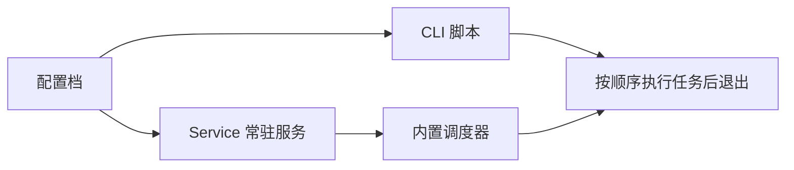

BAAS 后端既可以由 Tauri 客户端安装器启动，也可以在开发、服务器或 macOS/Linux 场景下通过命令行运行。旧 `baas-dev/docs` 中的 CLI 文档主要面向后端源码使用者；迁移到这里后，定位为“高级用法和开发参考”。

## 两种运行模式

| 模式             | 行为                                   | 适用场景                             |
| ---------------- | -------------------------------------- | ------------------------------------ |
| CLI 一次性模式   | 按脚本文件中的任务顺序执行，完成后退出 | cron、launchd、临时批处理            |
| Service 常驻模式 | 启动长期运行的后端服务，使用内置调度器 | Tauri 客户端、无人值守服务、开发调试 |



## CLI 一次性模式

旧后端 CLI 的使用方式是复制示例脚本，改成自己的配置档名称和任务列表：

```bash
cp cli.example.py cli.your_account.py
pdm run cli.your_account.py
```

这种模式不会常驻内存，适合配合系统计划任务执行。macOS 下如果使用 conda 环境，可以用：

```bash
conda run -n baas --live-stream pdm run cli.your_account.py
```

## Service 模式

Service 模式会启动一个常驻后端，并暴露 HTTP/WebSocket 接口给 Tauri 客户端或其他控制端。

```bash
python main.service.py --host 0.0.0.0 --port 8190 --log-level info
```

支持参数：

| 参数          | 作用         |
| ------------- | ------------ |
| `--host`      | 监听地址     |
| `--port`      | 监听端口     |
| `--reload`    | 开发时热重载 |
| `--log-level` | 日志等级     |

## 与 Tauri 客户端的关系

Tauri 客户端主要面向 Service 模式。客户端负责配置档、调度 UI、日志、远程画面和命令触发；后端 Service 负责认证、配置同步、任务执行和模拟器控制。

普通用户不需要手动启动 `main.service.py`。只有在下面场景才建议直接运行：

- 排查 Tauri 客户端无法连接后端。
- 需要查看完整后端终端日志。
- 在 macOS/Linux 上从源码运行。
- 为开发 WebSocket、认证、远程画面或配置同步功能做调试。

## 环境准备摘要

旧文档推荐使用 conda 或 venv 准备 Python 环境。后端源码运行通常需要：

```bash
conda create -n baas_env python=3.9.21
conda activate baas_env
pip install -r requirements.txt
```

Linux/macOS 环境按后端仓库实际 requirements 文件选择 `requirements-linux.txt` 或当前项目推荐命令。Tauri 用户优先使用安装器自动准备环境。
