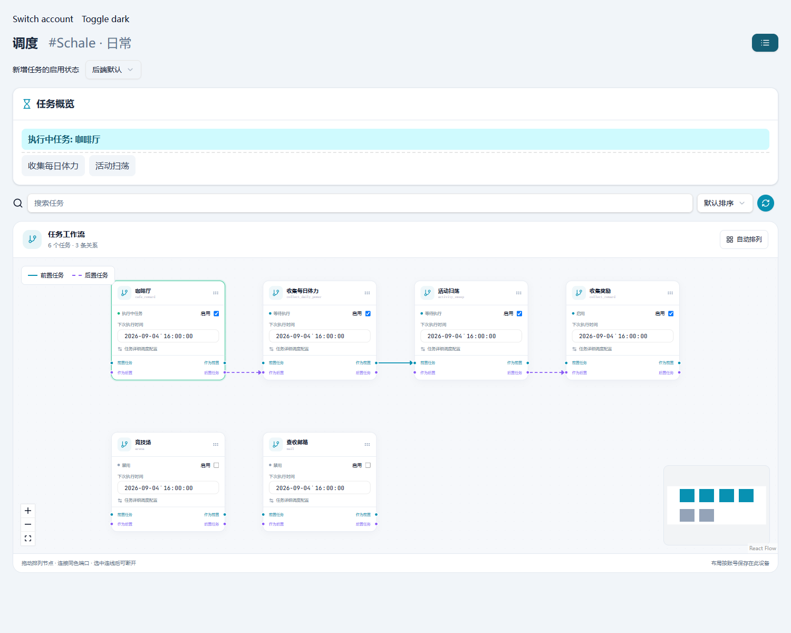

# Scheduler workflow and tray integration

Design references: [upstream #530](https://github.com/pur1fying/blue_archive_auto_script/pull/530) and [upstream #531](https://github.com/pur1fying/blue_archive_auto_script/pull/531).



## Scope

- Reuse the already integrated unrestricted-battle and friend-cleanup editors from #528. Their field names, conditional controls, limits, whitelist and persistence remain unchanged.
- Add a desktop-only, persisted **minimize to tray** preference. Existing close-to-tray behavior stays available. Tray actions show, hide, toggle and exit; if tray creation fails, normal window behavior remains available.
- Add a lazily loaded scheduler workflow alongside the original list. Switching editors does not replace the status/queue panel. Nodes are existing tasks, not a separate workflow execution engine.

## Graph semantics

Four ports keep two independent relationships explicit. Cyan, solid links run from “as prerequisite” to “prerequisite” and modify only the target's `pre_task`. Violet, dashed links run from “post-task” to “as post-task” and modify only the source's `post_task`. Removing one relationship never removes the other.

Creating self-links, duplicate relationships, mixed-port links or a new cycle is rejected. Existing cycles and unknown task references are warned about but are not silently removed. The detail editor remains available for the full existing scheduler configuration.

The graph supports node dragging, enable toggles, date/time editing, connection selection/disconnection, zoom, minimap navigation, search highlighting and deterministic automatic layout. Nodes cannot be created, renamed, copied or deleted. Disconnected tasks are arranged in a compact grid.

## Data and compatibility

Runtime data remains the backend event resource (`event.json`); the graph is not a second runtime source. Edits use existing sync JSON patches, for example `/3/pre_task`, rather than replacing the task array. Incoming patches now preserve array types and immutable snapshots. Untouched task fields, unknown fields and finite fractional `next_tick` values are preserved.

Layout is UI-only and saved in the existing application/browser store, namespaced by backend and account. Desktop local-backend identity does not depend on its dynamically allocated port. Unlike the Python UI, this client does not write `scheduler_graph.json` into backend account directories; this supports remote WebUI and avoids requiring upstream backend changes.

`new_event_enable_state` remains account-scoped (`default`, `on`, `off`). Sort mode belongs to shared UI settings. UI labels, warnings and validation errors are supplied in all seven existing locales. If graph loading fails, a localized fallback returns to the editable list.

## Verification

```powershell
bun test tests/frontend
bun run lint
bun run build:tauri
cargo test --workspace
cargo clippy --workspace --all-targets -- -D warnings
cargo fmt --all -- --check
```

Browser fixture (development only; not part of the production entry point):

```powershell
bun run dev:webui --host 127.0.0.1 --port 8294
# Open http://127.0.0.1:8294/tests/browser/scheduler.html
```

The fixture uses the real page and incoming-sync reducer, with isolated local test data instead of a BAAS connection. Exercise enable/time edits, same-pair pre/post links, rejected cycles, selective disconnection, list/graph switching, layout reload, account switching, sorting, search and light/dark/mobile layouts.

Native desktop smoke (blank isolated WebView, no singleton plugin, no backend, temporary WebView data):

```powershell
cargo run -p baas-tauri --example tray_smoke
cargo run -p baas-tauri --example tray_smoke -- --no-tray
```

The native smoke exercises the production tray/window handlers with real minimize/restore/hide/show/close events, including disabled preference and unavailable tray. It does not interact with another running BAAS instance.
